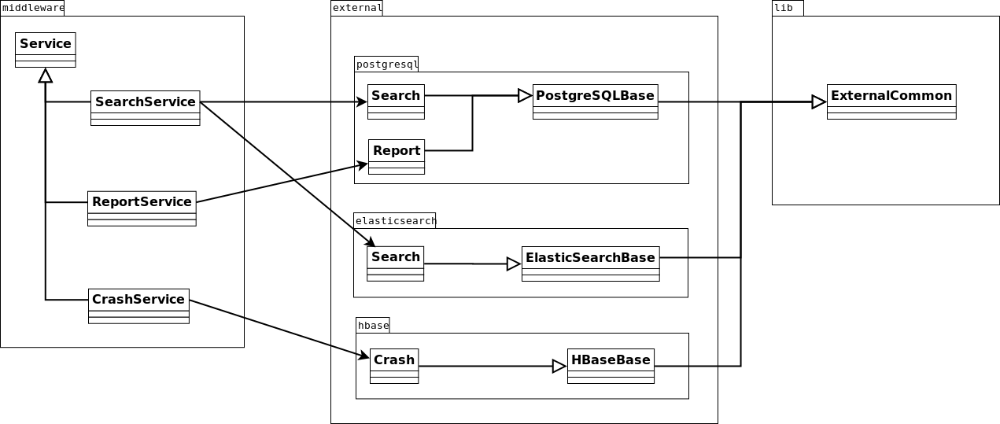

.. index:: addaservice

.. _addaservice-chapter:

Add a service to the Middleware
===============================

Architecture overview
---------------------

The middleware is a simple REST API providing JSON data depending on the URL
that is called. It is made of a list of services, each one binding a certain
URL with parameters. Documentation for each service is available in the
:ref:`middleware-chapter` page.

Those services are not containing any code, but are only interfaces. They are
using other resources from the external module. That external module is
composed of one submodule for each external resource we are using. For example,
there is a PostgreSQL submodule, an ElasticSearch submodule and a HBase
submodule.

You will also find some common code among external resources in socorro.lib.

Class hierarchy
---------------

REST services in Socorro are divided into two separate modules.
``socorro.middleware`` is the module that contains the actual service, the
class that will receive HTTP requests and return the right data. However,
services do not do any kind of computation, they only find the right
implementation class and call it.

Implementations of services are found in ``socorro.external``. They are
separated in submodules, one for each external resource that we use. For
example, in ``socorro.external.postgresql`` you will find everything that is
related to data stored in PostgreSQL: SQL queries mainly, but also arguments
sanitizing and data formating.

The way it works overall is simple: the service in ``socorro.middleware`` will
define a URL and will parse the arguments when the service is called. That
service will then find the right implementation class in ``socorro.external``
and call it with the parameters. The implementation class will do what it has
to do (SQL query, computation... ) and return a Python dictionary. The service
will then automatically transform that dictionary into a JSON string and send
it back via HTTP.

Create the service
------------------

First create a new file for your service in ``socorro/middleware/`` and call it
``nameofservice_service.py``. This is a convention for the next version of our
config manager. Then create a class inside as follow::

    import logging

    from socorro.middleware.service import DataAPIService

    logger = logging.getLogger("webapi")

    class MyService(DataAPIService):

        service_name = "my_service" # Name of the submodule to look for in external
        uri = "/my/service/(.*)" # URL of the service

        def __init__(self, config):
            super(MyService, self).__init__(config)
            logger.debug('MyService service __init__')

        def get(self, *args):
            # Parse parameters of the URL
            params = self.parse_query_string(args[0])

            # Find the implementation module in external depending on the configuration
            module = self.get_module(params)

            # Instantiate the implementation class
            impl = module.MyService(config=self.context)

            # Call and return the result of the implementation method
            return impl.mymethod(**params)

``uri`` is the URL pattern you want to match. It is a regular expression, and
the content of each part (``(.*)``) will be in ``args``.

``service_name`` will be used to find the corresponding implementation
resource. It has to match the filename of the module you need.

If you want to add mandatory parameters, modify the URI and values will be
passed in ``args``.

Use external resources
----------------------

The ``socorro.external`` contains everything related to outer resources like
databases. Each submodule has a base class and classes for specific
functionalities. If the function you need for your service is not already in
there, you create a new file and a new class to implement it. To do so,
follow this pattern::

    from socorro.external.myresource.base import MyResourceBase

    class MyModule(MyResourceBase):

        def __init__(self, *args, **kwargs):
            super(MyModule, self).__init__(*args, **kwargs)

        def my_method(self, **kwargs):
            do_stuff()
            return my_json_result

One of the things that you will want to do is filtering arguments and giving
them default values. There is a function to do that in
``socorro.lib.external_common`` that is called ``parse_arguments``. The
documentation of that function says::

    Return a dict of parameters.

    Take a list of filters and for each try to get the corresponding
    value in arguments or a default value. Then check that value's type.

    Example:
        filters = [
            ("param1", "default", ["list", "str"]),
            ("param2", None, "int"),
            ("param3", ["list", "of", 4, "values"], ["list", "str"])
        ]
        arguments = {
            "param1": "value1",
            "unknown": 12345
        }
        =>
        {
            "param1": ["value1"],
            "param2": 0,
            "param3": ["list", "of", "4", "values"]
        }

Here is an example of how to use this::

    class Products(PostgreSQLBase):
        def versions_info(self, **kwargs):
            # Parse arguments
            filters = [
                ("product", "Firefox", "str"),
                ("versions", None, ["list", "str"])
            ]
            params = external_common.parse_arguments(filters, kwargs)

            params.product # "Firefox" by default or a string
            params.versions # [] by default or a list of strings

Configuration
-------------

Finally add your service to the list of running services in
scripts/config/webapiconfig.py.dist as follow::

    import socorro.middleware.search_service as search
    import socorro.middleware.myservice_service as myservice # add

    servicesList = cm.Option()
    servicesList.doc = 'a python list of classes to offer as services'
    servicesList.default = [myservice.MyService, search.Search, (...)] # add

You can also add a config key for the implementation of your service. If you
don't, your service will use the default config key
(``serviceImplementationModule``). To add a specific configuration key::

    # MyService service config
    myserviceImplementationModule = cm.Option()
    myserviceImplementationModule.doc = "String, name of the module myservice uses."
    myserviceImplementationModule.default = 'socorro.external.elasticsearch' # for example

Then restart Apache and you should be good to go! If you're using a Vagrant VM,
you can hit the middleware directly by calling
http://socorro-api/bpapi/myservice/params/.

And then?
---------

Once you are done creating your service in the middleware, you might want to
use it in the WebApp. If so, have a look at :ref:`ui-chapter`.

You might also want to document it. We are keeping track of all existing
services' documentation in our :ref:`middleware-chapter` page. Please add
yours!
