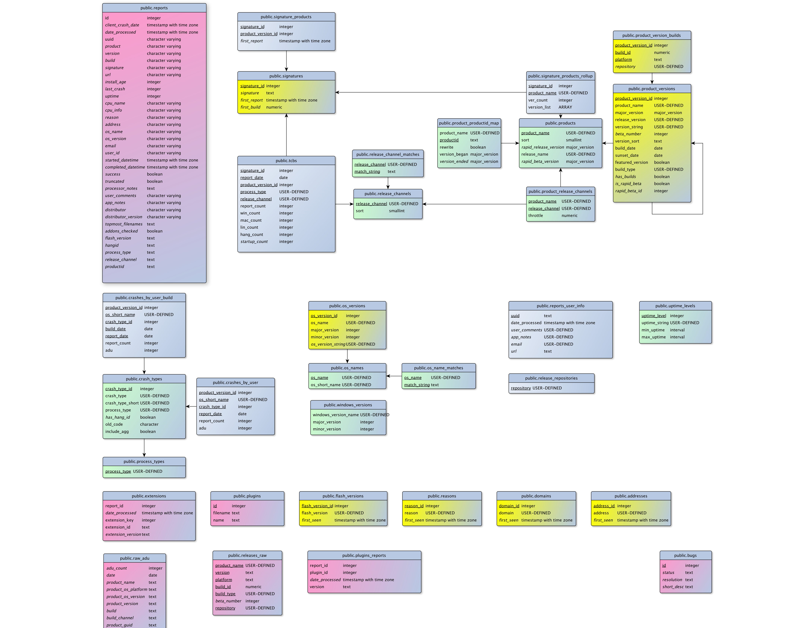
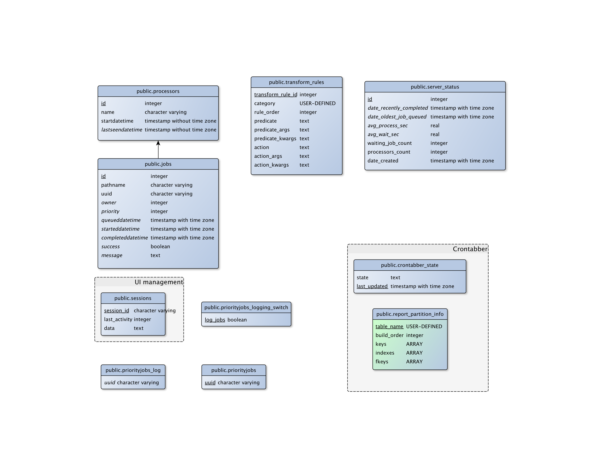
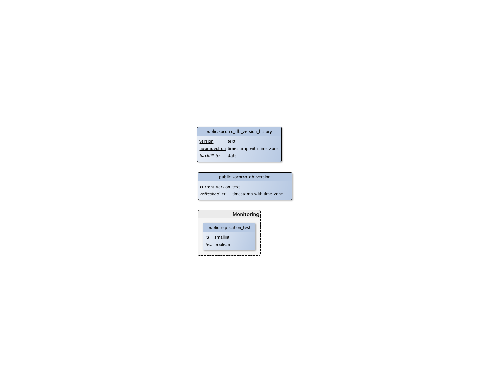

.. index:: databaseschema

.. _databaseschema-chapter:

Out-of-Date Data Warning
========================

While portions of this doc are still relevant and interesting for
current socorro usage, be aware that it is extremely out of date
when compared to current schema.

Database Schema
===============

Introduction
------------

Socorro is married to the PostgreSQL database: It makes use of a
significant number of PostgreSQL and psycopg2 (python) features and
extensions. Making a database-neutral API has been explored, and for
now is not being pursued.

The tables can be divided into three major categories: crash data,
aggregate reporting and process control.

crash data
----------

reports
-------

This table participates in DatabasePartitioning

Holds a lot of data about each crash report::

                                            Table "public.reports"
           Column        |           Type           |                      Modifiers                       
    ---------------------+--------------------------+------------------------------------------------------
     id                  | integer                  | not null default nextval('reports_id_seq'::regclass)
     client_crash_date   | timestamp with time zone | 
     date_processed      | timestamp with time zone | 
     uuid                | character varying(50)    | not null
     product             | character varying(30)    | 
     version             | character varying(16)    | 
     build               | character varying(30)    | 
     signature           | character varying(255)   | 
     url                 | character varying(255)   | 
     install_age         | integer                  | 
     last_crash          | integer                  | 
     uptime              | integer                  | 
     cpu_name            | character varying(100)   | 
     cpu_info            | character varying(100)   | 
     reason              | character varying(255)   | 
     address             | character varying(20)    | 
     os_name             | character varying(100)   | 
     os_version          | character varying(100)   | 
     email               | character varying(100)   | 
     user_id             | character varying(50)    | 
     started_datetime    | timestamp with time zone | 
     completed_datetime  | timestamp with time zone | 
     success             | boolean                  | 
     truncated           | boolean                  | 
     processor_notes     | text                     | 
     user_comments       | character varying(1024)  | 
     app_notes           | character varying(1024)  | 
     distributor         | character varying(20)    | 
     distributor_version | character varying(20)    | 
     topmost_filenames   | text                     | 
     addons_checked      | boolean                  | 
     flash_version       | text                     | 
     hangid              | text                     | 
     process_type        | text                     | 
     release_channel     | text                     | 
     productid           | text                     | 

Indexes and FKs from a child table: 

    Indexes:
        "reports_20121015_pkey" PRIMARY KEY, btree (id)
        "reports_20121015_unique_uuid" UNIQUE, btree (uuid)
        "reports_20121015_build_key" btree (build)
        "reports_20121015_date_processed_key" btree (date_processed)
        "reports_20121015_hangid_idx" btree (hangid)
        "reports_20121015_product_version_key" btree (product, version)
        "reports_20121015_reason" btree (reason)
        "reports_20121015_signature_date_processed_build_key" btree (signature, date_processed, build)
        "reports_20121015_url_key" btree (url)
        "reports_20121015_uuid_key" btree (uuid)
    Check constraints:
        "reports_20121015_date_check" CHECK ('2012-10-15 00:00:00+00'::timestamp with time zone <= date_processed AND date_processed < '2012-10-22 00:00:00+00'::timestamp with time z
    one)
    Referenced by:
        TABLE "extensions_20121015" CONSTRAINT "extensions_20121015_report_id_fkey" FOREIGN KEY (report_id) REFERENCES reports_20121015(id) ON DELETE CASCADE
        TABLE "plugins_reports_20121015" CONSTRAINT "plugins_reports_20121015_report_id_fkey" FOREIGN KEY (report_id) REFERENCES reports_20121015(id) ON DELETE CASCADE
    Inherits: reports

extensions
----------

This table participates in [[DatabasePartitioning]].

Holds data about what extensions are associated with a given report::

                    Table "public.extensions"
          Column       |           Type           | Modifiers 
    -------------------+--------------------------+-----------
     report_id         | integer                  | not null
     date_processed    | timestamp with time zone | 
     extension_key     | integer                  | not null
     extension_id      | text                     | not null
     extension_version | text                     | 

Partitioned Child Table
    Indexes:
        "extensions_20121015_pkey" PRIMARY KEY, btree (report_id, extension_key)
        "extensions_20121015_extension_id_extension_version_idx" btree (extension_id, extension_version)
        "extensions_20121015_report_id_date_key" btree (report_id, date_processed, extension_key)
    Check constraints:
        "extensions_20121015_date_check" CHECK ('2012-10-15 00:00:00+00'::timestamp with time zone <= date_processed AND date_processed < '2012-10-22 00:00:00+00'::timestamp with time zone)
    Foreign-key constraints:
        "extensions_20121015_report_id_fkey" FOREIGN KEY (report_id) REFERENCES reports_20121015(id) ON DELETE CASCADE
    Inherits: extensions

 Materialized View Reporting
 ===========================

 .. image:: matviews-socorro.png

Monitor, Processors and crontabber tables
=========================================

Admin tables
============

