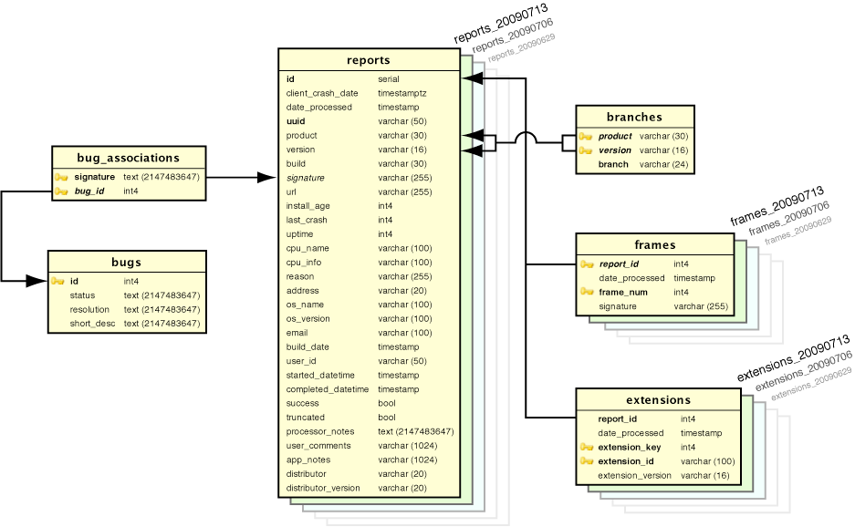

.. index:: databaseschema

.. _databaseschema-chapter:

Out-of-Date Data Warning
========================

While portions of this doc are still relevant and interesting for
current socorro usage, be aware that it is extremely out of date
when compared to current schema.

Database Schema
===============

Introduction
------------

Socorro is married to the PostgreSQL database: It makes use of a
significant number of PostrgeSQL and psycopg2 (python) features and
extensions. Making a database-neutral API has been explored, and for
now is not being pursued.

The tables can be divided into three major categories: crash data,
aggregate reporting and process control.

crash data
----------

reports
-------

This table participates in DatabasePartitioning

Holds a lot of data about each crash report::

                            Table "reports"
        Column        |            Type             |    Modifiers    | Description
 ---------------------+-----------------------------+-----------------+-------------
  id                  | integer                     | not null serial | unique id
  client_crash_date   | timestamp with time zone    |                 | as reported by client
  date_processed      | timestamp without time zone |                 | when entered into jobs table
  uuid                | character varying(50)       | not null        | unique tag for job
  product             | character varying(30)       |                 | name of product ("Firefox")
  version             | character varying(16)       |                 | version of product("3.0.6")
  build               | character varying(30)       |                 | build of product ("2009041522")
  signature           | character varying(255)      |                 | signature of 'top' frame of crash
  url                 | character varying(255)      |                 | associated with crash
  install_age         | integer                     |                 | in seconds since installed
  last_crash          | integer                     |                 | in seconds since last crash
  uptime              | integer                     |                 | in seconds since recent start
  cpu_name            | character varying(100)      |                 | as reported by client ("x86")
  cpu_info            | character varying(100)      |                 | as reported by client ("GenuineIntel family 15 model 4 stepping 1")
  reason              | character varying(255)      |                 | as reported by client
  address             | character varying(20)       |                 | memory address
  os_name             | character varying(100)      |                 | name of os ("Windows NT")
  os_version          | character varying(100)      |                 | version of os ("5.1.2600 Service Pack 3")
  email               | character varying(100)      |                 | -- deprecated
  build_date          | timestamp without time zone |                 | product build date (column build has same info, different format)
  user_id             | character varying(50)       |                 | -- deprecated
  started_datetime    | timestamp without time zone |                 | when processor starts processing report
  completed_datetime  | timestamp without time zone |                 | when processor finishes processing report
  success             | boolean                     |                 | whether finish was good
  truncated           | boolean                     |                 | whether some dump data was removed
  processor_notes     | text                        |                 | error messages during monitor processing of report
  user_comments       | character varying(1024)     |                 | if any, by user
  app_notes           | character varying(1024)     |                 | arbitrary, sent by client (exception detail, etc)
  distributor         | character varying(20)       |                 | future use: "Linux distro"
  distributor_version | character varying(20)       |                 | future use: "Linux distro version"

 Partitioned Child Table
 Indexes:
     "reports_aDate_pkey" PRIMARY KEY, btree (id)
     "reports_aDate_unique_uuid" UNIQUE, btree (uuid)
     "reports_aDate_date_processed_key" btree (date_processed)
     "reports_aDate_product_version_key" btree (product, version)
     "reports_aDate_signature_date_processed_key" btree (signature, date_processed)
     "reports_aDate_signature_key" btree (signature)
     "reports_aDate_url_key" btree (url)
     "reports_aDate_uuid_key" btree (uuid)
 Check constraints:
     "reports_aDate_date_check" CHECK (aDate::timestamp without time zone <= date_processed AND date_processed < aDate+WEEK::timestamp without time zone)
 Inherits: reports

dumps
-----

This table is deprecated (dump data is stored in the file system) see
[[DumpingDumpTables]] for more information.

branches
--------

This table has been replaced by a view of productdims::

 CREATE VIEW branches AS SELECT product,version,branch FROM productdims;

extensions
----------

This table participates in [[DatabasePartitioning]].

Holds data about what extensions are associated with a given report::

                     Table "extensions"
       Column       |            Type             | Modifiers | Description
  ------------------+-----------------------------+-----------+-------------
  report_id         | integer                     | not null  | in child: foreign key reference to child of table 'reports'
  date_processed    | timestamp without time zone |           | set to time when the row is inserted
  extension_key     | integer                     | not null  | the name of this extension
  extension_id      | character varying(100)      | not null  | the id of this extension
  extension_version | character varying(30)       |           | the version of this extension

  Partitioned Child Table
  Indexes:
     "extensions_aDate_pkey" PRIMARY KEY, btree (report_id)
     "extensions_aDate_report_id_date_key" btree (report_id, date_processed)
  Check constraints:
     "extensions_aDate_date_check" CHECK ('aDate'::timestamp without time zone <= date_processed AND date_processed < 'aDate+WEEK'::timestamp without time zone)
  Foreign-key constraints:
     "extensions_aDate_report_id_fkey" FOREIGN KEY (report_id) REFERENCES reports_aDate(id) ON DELETE CASCADE
  Inherits: extensions

frames
------

This table participates in [[DatabasePartitioning]]

Holds data about the frames in the dump associated with a particular
report::

                        Table "frames"
      Column     |            Type             | Modifiers | Description
 ----------------+-----------------------------+-----------+-------------
  report_id      | integer                     | not null  |  in child: foreign key reference to child of table reports
  date_processed | timestamp without time zone |           |  set to time when the row is inserted (?)
  frame_num      | integer                     | not null  |  ordinal: one row per stack-frame per report, from 0=top
  signature      | character varying(255)      |           |  signature as returned by minidump_stackwalk

 Partitioned Child Table
 Indexes:
     "frames_aDate_pkey" PRIMARY KEY, btree (report_id, frame_num)
     "frames_aDate_report_id_date_key" btree (report_id, date_processed)
 Check constraints:
     "frames_aDate_date_check" CHECK ('aDate'::timestamp without time zone <= date_processed AND date_processed < 'aDate+WEEK'::timestamp without time zone)
 Foreign-key constraints:
     "frames_aDate_report_id_fkey" FOREIGN KEY (report_id) REFERENCES reports_aDate(id) ON DELETE CASCADE
 Inherits: frames

 Aggregate Reporting
 ===================

 .. image:: SocorroSchema.Aggregate.20090722.png

productdims
------------

Dimension table that describes the product, version, gecko version
('branch') and type of release. Note that the release string is
completely determined by the version string: A version like 'X.Y.Z' is
'major'. A version with suffix 'pre' is 'development' and a version
with 'a' or 'b' (alpha or beta) is 'milestone'. Note: current version
does not conflate os details (see osdims)::

                     Table productdims
  Column  |     Type     | Modifiers | Description
 ---------+--------------+-----------+-------------
  id      | integer      | (serial)  |
  product | text         | not null  |
  version | text         | not null  |
  branch  | text         | not null  | gecko version
  release | release_enum |           | 'major', 'milestone', 'development'
 Indexes:
     "productdims_pkey1" PRIMARY KEY, btree (id)
     "productdims_product_version_key" UNIQUE, btree (product, version)
     "productdims_release_key" btree (release)

osdims
------

Dimension table that describes an operating system name and version.
Because there are so many very similar Linux versions, the data saved
here is simplified which allows many different 'detailed version'
Linuxen to share the same row in this table.::

                        Table osdims
    Column   |          Type          | Modifiers | Description
 ------------+------------------------+-----------+-------------
  id         | integer                | (serial)  |
  os_name    | character varying(100) |           |
  os_version | character varying(100) |           |
 Indexes:
     "osdims_pkey" PRIMARY KEY, btree (id)
     "osdims_name_version_key" btree (os_name, os_version)

product_visibility
------------------

Specifies the date-interval during which a given product
(productdims_id is the foreign key) is of interest for aggregate
analysis. MTBF obeys start_date, but calculates its own end date as 60
days later. Top crash by (url|signature) tables obey both start_date
and end_date. Column ignore is a boolean, default False, which allows
a product version to be quickly turned off. Note: Supersedes
mtbfconfig and tcbyurlconfig. (MTBF is not now in use)::

                      Table product_visibility
      Column     |            Type             |   Modifiers   | Description
 ----------------+-----------------------------+---------------+-------------
  productdims_id | integer                     | not null      |
  start_date     | timestamp without time zone |               |
  end_date       | timestamp without time zone |               |
  ignore         | boolean                     | default false |
 Indexes:
     "product_visibility_pkey" PRIMARY KEY, btree (productdims_id)
     "product_visibility_end_date" btree (end_date)
     "product_visibility_start_date" btree (start_date)
 Foreign-key constraints:
     "product_visibility_id_fkey" FOREIGN KEY (productdims_id) REFERENCES productdims(id) ON DELETE CASCADE

time_before_failure
-------------------

Collects daily summary of average (mean) time before failure for each
product of interest without regard to specific signature.::

                           Table time_before_failure
        Column       |            Type             | Modifiers  | Description
 --------------------+-----------------------------+------------+-------------
  id                 | integer                     | (serial)   |
  sum_uptime_seconds | double precision            | not null   |
  report_count       | integer                     | not null   |
  productdims_id     | integer                     |            |
  osdims_id          | integer                     |            |
  window_end         | timestamp without time zone | not null   |
  window_size        | interval                    | not null   |
 Indexes:
   "time_before_failure_pkey" PRIMARY KEY, btree (id)
   "time_before_failure_os_id_key" btree (osdims_id)
   "time_before_failure_product_id_key" btree (productdims_id)
   "time_before_failure_window_end_window_size_key" btree (window_end, window_size)
 Foreign-key constraints:
   "time_before_failure_osdims_id_fkey" FOREIGN KEY (osdims_id) REFERENCES osdims(id) ON DELETE CASCADE
   "time_before_failure_productdims_id_fkey" FOREIGN KEY (productdims_id) REFERENCES productdims(id) ON DELETE CASCADE

top_crashes_by_signature
------------------------

The "fact" table that associates signatures with crash statistics::

                            Table top_crashes_by_signature
      Column     |            Type             |      Modifiers     | Description
 ----------------+-----------------------------+--------------------+-------------
  id             | integer                     | (serial)           |
  count          | integer                     | not null default 0 |
  uptime         | real                        | default 0.0        |
  signature      | text                        |                    |
  productdims_id | integer                     |                    |
  osdims_id      | integer                     |                    |
  window_end     | timestamp without time zone | not null           |
  window_size    | interval                    | not null           |
 Indexes:
     "top_crashes_by_signature_pkey" PRIMARY KEY, btree (id)
     "top_crashes_by_signature_osdims_key" btree (osdims_id)
     "top_crashes_by_signature_productdims_key" btree (productdims_id)
     "top_crashes_by_signature_signature_key" btree (signature)
     "top_crashes_by_signature_window_end_idx" btree (window_end DESC)
 Foreign-key constraints:
     "osdims_id_fkey" FOREIGN KEY (osdims_id) REFERENCES osdims(id) ON DELETE CASCADE
     "productdims_id_fkey" FOREIGN KEY (productdims_id) REFERENCES productdims(id) ON DELETE CASCADE

urldims
-------

A dimensions table that associates an url and its domain with a
particular id.

For example, given full url
http://www.whatever.com/some/path?foo=bar&goo=car

the domain is the host name: www.whatever.com

the url is everything before the query part:
http://www.whatever.com/some/path::

                       Table "urldims"
  Column |          Type          |     Modifiers   | Description
 --------+------------------------+-----------------+-------------
  id     | integer                | not null serial | unique id
  domain | character varying(255) | not null        | the hostname
  url    | character varying(255) | not null        | the url up to query
 Indexes:
     "urldims_pkey" PRIMARY KEY, btree (id)
     "urldims_url_domain_key" UNIQUE, btree (url, domain)

top_crashes_by_url
------------------

The "fact" table that associates urls with crash statistics::

                          Table top_crashes_by_url
      Column     |            Type             | Modifiers | Description
 ----------------+-----------------------------+-----------+-------------
  id             | integer                     | (serial)  |
  count          | integer                     | not null  |
  urldims_id     | integer                     |           |
  productdims_id | integer                     |           |
  osdims_id      | integer                     |           |
  window_end     | timestamp without time zone | not null  |
  window_size    | interval                    | not null  |
 Indexes:
     "top_crashes_by_url_pkey" PRIMARY KEY, btree (id)
     "top_crashes_by_url_count_key" btree (count)
     "top_crashes_by_url_osdims_key" btree (osdims_id)
     "top_crashes_by_url_productdims_key" btree (productdims_id)
     "top_crashes_by_url_urldims_key" btree (urldims_id)
     "top_crashes_by_url_window_end_window_size_key" btree (window_end, window_size)
 Foreign-key constraints:
     "top_crashes_by_url_osdims_id_fkey" FOREIGN KEY (osdims_id) REFERENCES osdims(id) ON DELETE CASCADE
     "top_crashes_by_url_productdims_id_fkey" FOREIGN KEY (productdims_id) REFERENCES productdims(id) ON DELETE CASCADE
     "top_crashes_by_url_urldims_id_fkey" FOREIGN KEY (urldims_id) REFERENCES urldims(id) ON DELETE CASCADE

top_crashes_by_url_signature
----------------------------

Associates count of each signature with a row in top_crashes_by_url
table::

         Table top_crashes_by_url_signature
         Column         |  Type   | Modifiers | Description
 -----------------------+---------+-----------+-------------
  top_crashes_by_url_id | integer | not null  |
  signature             | text    | not null  |
  count                 | integer | not null  |
 Indexes:
   "top_crashes_by_url_signature_pkey" PRIMARY KEY, btree (top_crashes_by_url_id, signature)
 Foreign-key constraints:
   "top_crashes_by_url_signature_fkey" FOREIGN KEY (top_crashes_by_url_id) REFERENCES top_crashes_by_url(id) ON DELETE CASCADE

topcrashurlfactsreports
-----------------------

Associates a job uuid with comments and a row in the topcrashurlfacts
table.::

                   Table "topcrashurlfactsreports"
        Column        |          Type          |  Modifiers      | Description
 ---------------------+------------------------+-----------------+-------------
  id                  | integer                | not null serial | unique id
  uuid                | character varying(50)  | not null        | job uuid string
  comments            | character varying(500) |                 | ?programmer provided?
  topcrashurlfacts_id | integer                |                 | crash statistics for a product,os,url,signature and day
 Indexes:
     "topcrashurlfactsreports_pkey" PRIMARY KEY, btree (id)
     "topcrashurlfactsreports_topcrashurlfacts_id_key" btree (topcrashurlfacts_id)
 Foreign-key constraints:
     "topcrashurlfactsreports_topcrashurlfacts_id_fkey" FOREIGN KEY (topcrashurlfacts_id) REFERENCES topcrashurlfacts(id) ON DELETE CASCADE

alexa_topsites
--------------

Stores a weekly dump of the top 1,000 sites as measured by Alexa (csv)::

                     Table "public.alexa_topsites"
     Column    |            Type             |       Modifiers
 --------------+-----------------------------+------------------------
  domain       | text                        | not null
  rank         | integer                     | default 10000
  last_updated | timestamp without time zone | not null default now()
 Indexes:
     "alexa_topsites_pkey" PRIMARY KEY, btree (domain)
