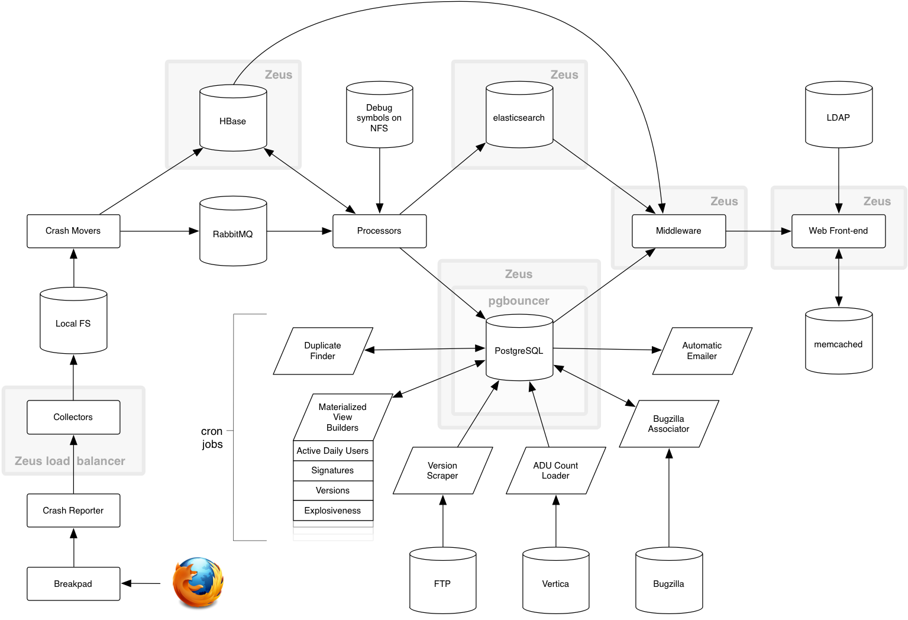

.. index:: generalarchitecture

.. _generalarchitecture-chapter:

General architecture of Socorro
===============================

Arrows direction represents the flow of interesting information (crashes,
authentication assertions, cached values), not trivia like acks.

Top-level folders
-----------------

If you clone our `git repository <https://github.com/mozilla/socorro>`_, you
will find the following folders. Here is what each of them contains:

+-----------------+-------------------------------------------------------------+
| Folder          | Description                                                 |
+=================+=============================================================+
| config/         | Contains the Apache configuration for the different parts   |
|                 | of the Socorro application.                                 |
+-----------------+-------------------------------------------------------------+
| docs/           | Documentation of the Socorro project (the one you are       |
|                 | reading right now).                                         |
+-----------------+-------------------------------------------------------------+
| scripts/        | Scripts for launching the different parts of the Socorro    |
|                 | application.                                                |
+-----------------+-------------------------------------------------------------+
| socorro/        | Core code of the Socorro project.                           |
+-----------------+-------------------------------------------------------------+
| sql/            | SQL scripts related to our PostgreSQL database. Contains    |
|                 | schemas and update queries.                                 |
+-----------------+-------------------------------------------------------------+
| thirparty/      | External libraries used by Socorro.                         |
+-----------------+-------------------------------------------------------------+
| tools/          | External tools used by Socorro.                             |
+-----------------+-------------------------------------------------------------+
| webapp-django/  | Front-end Django application (also called UI). See          |
|                 | :ref:`ui-chapter`.                                          |
+-----------------+-------------------------------------------------------------+

Socorro submodules
------------------

The core code module of Socorro, called ``socorro``, contains a lot of code.
Here are descriptions of every submodule in there:

+-------------------+---------------------------------------------------------------+
| Module            | Description                                                   |
+===================+===============================================================+
| collector         | All code related to collectors.                               |
+-------------------+---------------------------------------------------------------+
| cron              | All cron jobs running around Socorro.                         |
+-------------------+---------------------------------------------------------------+
| database          | PostgreSQL related code.                                      |
+-------------------+---------------------------------------------------------------+
| external          | Here are APIs related to external resources like databases.   |
+-------------------+---------------------------------------------------------------+
| middleware        | New-style middleware services place.                          |
+-------------------+---------------------------------------------------------------+
| unittest          | All our unit tests are here.                                  |
+-------------------+---------------------------------------------------------------+
| webapi            | Contains a few tools used by web-based services.              |
+-------------------+---------------------------------------------------------------+
