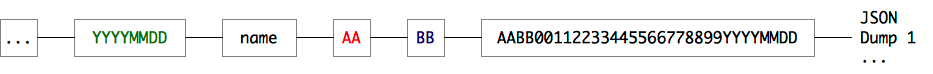
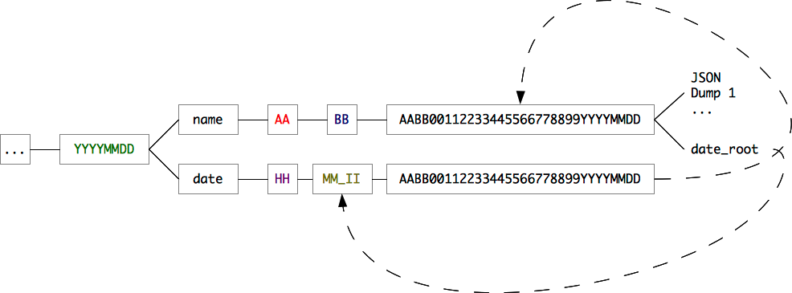

New Filesystem
==============

The new filesystem module (``socorro.external.fs``) is a rewrite of
``socorro.external.filesystem`` to use the new, more consistent crash storage
API. It consists of two crash storage classes: ``FSRadixTreeStorage`` and
``FSDatedRadixTreeStorage``.

``FSRadixTreeStorage``
----------------------

This storage class employs a radix scheme taking the hex digits in pairs from
the start of crash_id.  For example, a crash_id that looks like
``38a4f01e...20090514`` would be stored in a directory structure like this::

    .../20090514/name/38/a4/f0/1e/38a4f01e...20090514

The depth of directory is specified by the seventh directory from the right,
i.e. the first 0 in 2009 in the example. By default, if the value is 0, the
nesting is 4.

The leaf directory contains the raw crash information, exported as JSON, and
the various associated dump files -- or, if being used as processed storage,
contains the processed JSON file.

``FSDatedRadixTreeStorage``
---------------------------

This storage class extends ``FSRadixTreeStorage`` to include a date branch.
The date branch implements an indexing scheme so that the rough order in
which the crashes arrived is known. The directory structure consists of the
hour, the minute and the interval of seconds the crash was received for
processing -- for instance, if a crash was received at 3:30:12pm, the directory
structure would look something like::

    .../20090514/date/15/30_03/38a4f01e...20090514

(the 03 in 30_03 corresponds to an interval slice of 4: 12 // 4 = 3)

In the example, the date 20090514 corresponds to the date assigned by the
collector from the crash's ID, rather than the date the crash was received by
the processor.

The crash ID in the dated folder is a symbolic link to the same folder in the
radix tree, e.g. the directory given in the example would be linked to
``.../20090514/name/38/a4/f0/1e/38a4f01e...20090514``. A corresponding link,
named ``date_root``, is created in the folder which is linked to
``.../20090514/date/15/30_03``. This is so that jumps can be made between the
two directory hierarchies -- crash data can be obtained by visiting the dated
hierarchy, and a crash's location in the dated hierarchy can be found by
looking the crash up by its ID.

This dated directory structure enables efficient traversal of the folder
hierarchy for new crashes -- first, all the date directories in the root are
traversed to find all the symbolic links to the radix directories. When one is
found, it is unlinked from the filesystem and the ID yielded to the interested
caller. This proceeds until we exhaust all the directories to visit, by which
time all the crashes should be visited.

In order to prevent race conditions, the process will compute the current slot
and decline to enter any slots with a number greater than the current slot --
this is because a process may already be currently writing to it.
