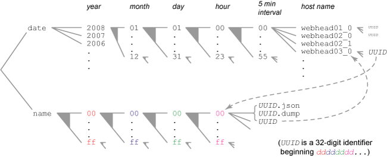

.. This Source Code Form is subject to the terms of the Mozilla Public
.. License, v. 2.0. If a copy of the MPL was not distributed with this
.. file, You can obtain one at http://mozilla.org/MPL/2.0/.

.. index:: jsondumpstorage

.. _jsondumpstorage-chapter:

JSON Dump Storage
=================

What this system offers
-----------------------

Crash data is stored so that it can be quickly located based on a
Universally Unique Identifier (uuid) or visited by the date and time
when reported

Directory Structure
-------------------

The crash files are located in a tree with two branches: the name or "index" branch and the date branch.

* The name branch consists of paths based on the first few pairs of characters of the uuid. Name branch holds the two data files and a relative symbolic link to the date branch directory associated with the particular uuid. For the uuid: 22adfb61-f75b-11dc-b6be-001321b0783d The "depth" is the number of sub-directories between the name directory and the actual file. By default, to conserve inodes, depth is two.
    * By default, the json file is stored (depth 2) as %(root)s/name/22/ad/22adfb61-f75b-11dc-b6be-001321b0783d.json
    * The json file could be stored (depth 4) as %(root)s/name/22/ad/fb/61/22adfb61-f75b-11dc-b6be-001321b0783d.json
    * The dump file is stored as %(root)s/name/22/ad/22adfb61-f75b-11dc-b6be-001321b0783d.dump
    * The symbolic link is stored as %(root)s/name/22/ad/22adfb61-f75b-11dc-b6be-001321b0783d and (see below) references (own location)/%(toDateFromName)s/2008/09/30/12/05/webhead01_0/
* The date branch consists of paths based on the year, month, day, hour, minute-segment, webhead host name and a small sequence number. For each uuid, it holds a relative symbolic link referring to the actual name directory holding the data for that uuid. For the uuid above, submitted at 2008-09-30T12:05 from webhead01
    * The symbolic link is stored as %(root)s/date/2008/09/30/12/05/webhead01_0/22adfb61-f75b-11dc-b6be-001321b0783d and references (own location)/%(toNameFromDate)s/22/ad/fb/61/

* Note (name layout) In the examples on this page, the name/index branch uses the first 4 characters of the uuid as two character-pairs naming subdirectories. This is a configurable setting called storageDepth in the :ref:`collector-chapter` configuration. To use the 8 characters, storageDepth is set to 4. To use 6 characters, set to 3. The default storageDepth is 2 because on our system, with (approximately) 64K leaf directories, the number of files per leaf is reasonable; and the number of inodes required by directory entries is not so large as to cause undue difficulty. A storageDepth of 4 was examined, and was found to crash the file system by requiring too many inodes.

* If the uuids are such that their initial few characters are well spread among all possibles, then the lookup can be very quick. If the first few characters of the uuids are not well distributed, the resulting directories may be very large. If, despite well chosen uuids, the leaf name directories become too large, it would be simple to add another level, reducing the number of files by approximately a factor of 256; however bear in mind the issue of inodes.

* Note (symbolic links) The symbolic links are relative rather than absolute, to avoid issues that might arise from variously mounted nfs volumes.

* Note (maxDirectoryEntries) If the number of links in a particular webhead subdirectory would exceed maxDirectoryEntries, then a new webhead directory is created by appending a larger _N : .../webhead01_0 first, then .../webhead01_1 etc. For the moment, maxDirectoryEntries is ignored for the name branch.

How it's used
-------------

We use the file system storage for incoming dumps caught by
:ref:`collector-chapter`. There are two instances of the file system used for
different purposes: standard storage and deferred storage.

:ref:`standardjobstorage-chapter`
---------------------------------

This is where json/dump pairs are stored for further processing. The
:ref:`monitor-chapter` finds new dumps and queues them for processing. It does
this by walking the date branch of the file system using the API
function destructiveDateWalk. As it moves through the date branch, it
notes every uuid (in the form of a symbolic link) that it encounters.
It queues the information from the symbolic link and then deletes the
symbolic link. This insures that it only ever finds new entries.
Later, the :ref:`processor-chapter` will read the json/dump pair by doing a
direct lookup of the uuid on the name branch.

In the case of priority processing, the target uuid is looked up
directly on the name branch. Then the link to the date branch is used
to locate and delete the link on the date branch. This insures that a
priority job is not found a second time as a new job by the
:ref:`monitor-chapter`.

:ref:`deferredjobstorage-chapter`
---------------------------------

This is where jobs go that are deferred by :ref:`monitor-chapter`'s throttling
mechanism. If a json/dump pair is needed for priority processing, it
can be looked up directly on the name branch. In such a case, just as
with priority jobs in standard storage, we destroy the links between
the two branches. However, in this case, destroying the links prevents
the json/dump pair from being deleted by the deferred cleanup process.

When it comes time to drop old json/dump pairs that are no longer
needed within the deferred storage, the system is given a date
threshold. It walks the appropriate parts of the date branch older
than the threshold. It uses the links to the name branch to blow away
the elderly json/dump pairs.

class JsonDumpStorage
---------------------

``socorro.lib.JsonDumpStorage`` holds data and implements methods for
creating and accessing crash files.

**public methods**

* ``__init__(self, root=".", maxDirectoryEntries=1024, **kwargs)``

  Take note of our root directory, maximum allowed date->name links per directory, some relative relations, and whatever else we may need. Much of this (c|sh)ould be read from a config file.

        Recognized keyword args:

        * dateName. Default = 'date'
        * indexName. Default = 'name'
        * jsonSuffix. Default = '.json'. If not startswith('.') then '.' is prepended
        * dumpSuffix. Default = '.dump'. If not startswith('.') then '.' is prepended
        * dumpPermissions. Default 660
        * dirPermissions. Default 770
        * dumpGID. Default None. If None, then owned by the owner of the running script.

* ``newEntry (self, uuid, webheadHostName='webhead01', timestamp=DT.datetime.now())``

    Sets up the name and date storage for the given uuid.

      * Creates any directories that it needs along the path to the appropriate storage location (possibly adjusting ownership and mode)
      * Creates two relative symbolic links:
          * the date branch link pointing to the name directory holding the files;
          * the name branch link pointing to the date branch directory holding that link.
      * Returns a 2-tuple containing files open for writing: (jsonfile,dumpfile)

* ``getJson (self, uuid)``

    Returns an absolute pathname for the json file for a given uuid. Raises OSError if the file is missing

* ``getDump (self, uuid)``

    Returns an absolute pathname for the dump file for a given uuid. Raises OSError if the file is missing

* ``markAsSeen (self,uuid)``

    Removes the links associated with the two data files for this uuid, thus marking them as seen. Quietly returns if the uuid has no associated links.

* ``destructiveDateWalk (self)``

    This function is a generator that yields all(see note) uuids found by walking the date branch of the file system.

        Just before yielding a value, it deletes both the links (from date to name and from name to date)
        After visiting all the uuids in a given date branch, recursively deletes any empty subdirectories in the date branch
        Since the file system may be manipulated in a different thread, if no .json or .dump file is found, the links are left, and we do not yield that uuid
        note To avoid race conditions, does not visit the date subdirectory corresponding to the current time

* ``remove (self, uuid)``

    Removes all instances of the uuid from the file system including the json file, the dump file, and the two links if they still exist.

       * Ignores missing link, json and dump files: You may call it with bogus data, though of course you should not

* ``move (self, uuid, newAbsolutePath)``

    Moves the json file then the dump file to newAbsolutePath.

        * Removes associated symbolic links if they still exist.
        * Raises IOError if either the json or dump file for the uuid is not found, and retains any links, but does not roll back the json file if the dump file is not found.

* ``removeOlderThan (self, timestamp)``

      * Walks the date branch removing all entries strictly older than the timestamp.
      * Removes the corresponding entries in the name branch.

**member data**

Most of the member data are set in the constructor, a few are
constants, the rest are simple calculations based on the others.

* root: The directory that holds both the date and index(name) subdirectories
* maxDirectoryEntries: The maximum number of links in each webhead directory on the date branch. Default = 1024
* dateName: The name of the date branch subdirectory. Default = 'date'
* indexName: The name of the index branch subdirectory. Default = 'name'
* jsonSuffix: the suffix of the json crash file. Default = '.json'
* dumpSuffix: the suffix of the dump crash file. Default = '.dump'
* dateBranch: The full path to the date branch
* nameBranch: The full path to the index branch
* dumpPermissions: The permissions for the crash files. Default = 660
* dirPermissions: The permissions for the directories holding crash files. Default = 770
* dumpGID: The group ID for the directories and crash files. Default: Owned by the owner of the running script.
* toNameFromDate: The relative path from a leaf of the dateBranch to the nameBranch
* toDateFromName: The relative path from a leaf of the nameBranch to the dateBranch
* minutesPerSlot: How many minutes in each sub-hour slot. Default = 5
* slotRange: A precalculated range of slot edges = range(self.minutesPerSlot, 60, self.minutesPerSlot)
