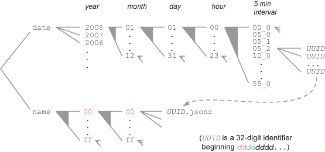

.. index:: processeddumpstorage

.. _processeddumpstorage-chapter:

Processed Dump Storage
======================

Processed dumps are stored in two places: the relational database as
well as in flat files within a file system. This forking of the
storage scheme came from the realization that the infrequently used
data within the database 'dumps' tables was causing performance
problems within PostgreSQL. The 'dumps' tables took nearly eighty
percent of the total storage, making replication and backup
problematic. Since the 'dumps' table's data is used only when a user
requests a specific crash dump by uuid, most of the data is rarely, if
ever, accessed.

We decided to migrate these dump into a file system storage outside
the database. Details can be seen at: :ref:`dumpingdumptables-chapter`

In the file system, after processing, dumps are stored a gzip
compressed JSON file format. This format echos a flattening of the
'reports', 'extensions' and the now deprecated 'dumps' tables within
the database.

Directory Structure
-------------------

Just as in the JsonDumpStorage scheme, there are two branches: 'name' and 'date'

Access by Name
--------------

Most lookups of processed crash data happens by name. We use a radix
storage technique where the first 4 characters of the file name are
used for two levels of directory names. A file called
aabbf9cb-395b-47e8-9600-4f20e2090331.jsonz would be found in the file
system as .../aa/bb/aabbf9cb-395b-47e8-9600-4f20e2090331.jsonz

Access by Date
--------------

For the purposes of finding crashes that happened at specific date and
time, a hierarchy of date directories offer quick lookup. The leaves
of the date directories contain symbolic links to the locations of
crash data.

JSON File Format
----------------

example::

 {"signature": "nsThread::ProcessNextEvent(int, int*)",
  "uuid": "aabbf9cb-395b-47e8-9600-4f20e2090331",
  "date_processed": "2009-03-31 14:45:09.215601",
  "install_age": 100113,
  "uptime": 7,
  "last_crash": 95113,
  "product": "SomeProduct",
  "version": "3.5.2",
  "build_id": "20090223121634",
  "branch": "1.9.1",
  "os_name": "Mac OS X",
  "os_version": "10.5.6 9G55",
  "cpu_name": "x86",
  "cpu_info":     "GenuineIntel family 6 model 15 stepping 6",
  "crash_reason": "EXC_BAD_ACCESS / KERN_INVALID_ADDRESS",
  "crash_address": "0xe9b246",
  "User Comments": "This thing crashed.\nHelp me Kirk.",
  "app_notes": "",
  "success": true,
  "truncated": false,
  "processor_notes": "",
  "distributor":"",
  "distributor_version": "",
  "add-ons": [["{ABDE892B-13A8-4d1b-88E6-365A6E755758}", "1.0"], ["{b2e293ee-fd7e-4c71-a714-5f4750d8d7b7}", "2.2.0.9"], ["{972ce4c6-7e08-4474-a285-3208198ce6fd}", "3.5.2"]],
  "dump":"OS|Mac OS X|10.5.6 9G55\\nCPU|x86|GenuineIntel family 6 model 15 stepping 6|2\\nCrash|EXC_BAD_ACCESS / KERN_PROTECTION_FAILURE|0x1558c095|0\\n
  Module|firefox-bin||firefox-bin|988FA8BFC789C4C07C32D61867BB42B60|0x00001000|0x00001fff|\\n.....
   "}

The "dump" component is the direct streamed output from the Breakpad
"minidump_stackwalk" program. Unfortunately, that project does not
give detailed documentation of the format.
