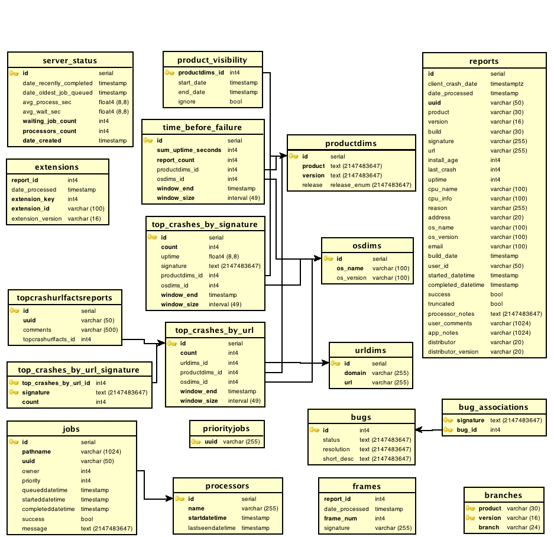

.. This Source Code Form is subject to the terms of the Mozilla Public
.. License, v. 2.0. If a copy of the MPL was not distributed with this
.. file, You can obtain one at http://mozilla.org/MPL/2.0/.

.. index:: schema

.. _schema-chapter:

Schema
======

(See bottom of page for inline graphic)

Tables used primarily when processing Jobs
==========================================

**Reports (Partitioned)**

Reports table contains the 'cooked' data received from breakpad and
abstracted. Data from this table is further transformed into
'materialized views' (see below). Reports is unchanged from prior
version.::

 CREATE TABLE reports (
   id serial NOT NULL PRIMARY KEY,
   client_crash_date timestamp with time zone,
   date_processed timestamp without time zone,
   uuid character varying(50) NOT NULL UNIQUE,
   product character varying(30),
   version character varying(16),
   build character varying(30),
   signature character varying(255),
   url character varying(255),
   install_age integer,
   last_crash integer,
   uptime integer,
   cpu_name character varying(100),
   cpu_info character varying(100),
   reason character varying(255),
   address character varying(20),
   os_name character varying(100),
   os_version character varying(100),
   email character varying(100), -- Now always NULL or empty
   build_date timestamp without time zone,
   user_id character varying(50), -- Now always NULL or empty
   started_datetime timestamp without time zone,
   completed_datetime timestamp without time zone,
   success boolean,
   truncated boolean,
   processor_notes text,
   user_comments character varying(1024),
   app_notes character varying(1024),
   distributor character varying(20),
   distributor_version character varying(20)
  );
  Indices are on child/partition tables, not base table
  index: date_processed
  index: uuid
  index: signature
  index: url
  index: (product,version)
  index: (uuid, date_processed)
  index: (signature, date_processed)

**Processors**

Processors table keeps track of the current state of the processor
that pull things out of the file system and into the reports database.
Processors is unchanged from prior version.::

 CREATE TABLE processors (
   id serial NOT NULL PRIMARY KEY,
   name varchar(255) NOT NULL UNIQUE,
   startdatetime timestamp without time zone NOT NULL,
   lastseendatetime timestamp without time zone
 );

**Jobs**

Jobs table holds data about jobs that are queued for the processors to
handle. Jobs is unchanged from prior version.::

 CREATE TABLE jobs (
   id serial NOT NULL PRIMARY KEY,
   pathname character varying(1024) NOT NULL,
   uuid varchar(50) NOT NULL UNIQUE,
   owner integer,
   priority integer DEFAULT 0,
   queueddatetime timestamp without time zone,
   starteddatetime timestamp without time zone,
   completeddatetime timestamp without time zone,
   success boolean,
   message text,
   FOREIGN KEY (owner) REFERENCES processors (id) on delete cascade
 );
 index: owner
 index: (owner, starteddatetime)
 index (completeddatetime, priority DESC)

**Priority Jobs**

Priority Jobs table is used to mark rows in the jobs table that need
to be processed soon. Priority Jobs is unchanged from prior versions.::

 CREATE TABLE priortyjobs (
   uuid varchar(255) NOT NULL PRIMARY KEY
 );

Tables primarily used during data extraction
============================================

**Branches**

Branches table associates a product and version with with the gecko
version (called 'branch')::

 CREATE TABLE branches (
   product character varying(30) NOT NULL,
   version character varying(16) NOT NULL,
   branch character varying(24) NOT NULL
 );

**Extensions (Partitioned)**

Extensions table associates a report with the extensions on the
crashing application. Extensions is unchanged from prior version. (Not
now in use)::

  CREATE TABLE extensions (
   report_id integer NOT NULL, -- Foreign key references parallel reports partition(id)
   date_processed timestamp without time zone,
   extension_key integer NOT NULL,
   extension_id character varying(100) NOT NULL,
   extension_version character varying(16),
   FOREIGN KEY (report_id) REFERENCES reports_<partition>(id) on delete cascade
 );
 Index is on child/partition tables, not base table
 index: (report_id,date_processed)

**Frames (Partitioned)**

Frames table associates a report with the stack frames and their
signatures that were seen in the crashing application. Frames is
unchanged from prior version.::

 CREATE TABLE frames (
   report_id integer NOT NULL,
   date_processed timestamp without time zone,
   frame_num integer NOT NULL,
   signature varchar(255)
   FOREIGN KEY (report_id) REFERENCES reports_<partition>(id) on delete cascade
 );
 Index is on child/partition tables, not base table
 index: (report_id,date_processed)

**Plugins**

Electrolysis support for out of process plugin crashes::

 CREATE TABLE plugins
    (

        id serial NOT NULL PRIMARY KEY,
        filename TEXT NOT NULL,
        name TEXT NOT NULL,
        CONSTRAINT filename_name_key UNIQUE (filename, name)
    )

**Plugins_Reports? (Partitioned)**

Records oopp details. a report has 0 or 1 entry in this table.::

 CREATE TABLE plugins_reports
    (
        report_id INTEGER NOT NULL,
        plugin_id INTEGER NOT NULL,
        date_processed TIMESTAMP WITHOUT TIME ZONE,
        version TEXT NOT NULL
    )

Indices are on child/partition tables, not base table. Setup via
schema.py Example for plugins_reports_20100125::

 PRIMARY KEY (report_id, plugin_id),
 CONSTRAINT plugins_reports_20100125_report_id_fkey FOREIGN KEY (report_id) REFERENCES reports_20100125 (id) ON DELETE CASCADE,
 CONSTRAINT plugins_reports_20100125_plugin_id_fkey FOREIGN KEY (plugin_id) REFERENCES plugins (id) ON DELETE CASCADE,
 CONSTRAINT plugins_reports_20100125_date_check CHECK (('2010-01-25 00:00:00'::TIMESTAMP without TIME zone <= date_processed) AND ( date_processed < '2010-02-01 00:00:00'::TIMESTAMP without TIME zone)

Tables primarily used for materialized views
============================================

**product visibility**

Product visibility controls which products are subject to having data
aggregated into the various materialized views. Replaces mtbfconfig,
tcbyurlconfig::

 CREATE TABLE product_visibility (
   productdims_id integer NOT NULL PRIMARY KEY,
   start_date timestamp, -- set this manually for all mat views
   end_date timestamp,   -- set this manually: Used by mat views that care
   ignore boolean default False, -- force aggregation off for this product id
   FOREIGN KEY (productdims_id) REFERENCES productdims(id)
 );
 index: end_date
 index: start_date

Dimensions tables
=================

**signaturedims**

Signature dims was a table associating signature with id, no longer
used. Instead, signatures are stored directly in the places that need
them.

**productdims**

Product dims associates a product, version and release key. An enum is
used for the release key. Product dims has changed from prior version
by dropping the os_name column, which has been promoted into its own
osdims table.::

 CREATE TYPE release_enum AS ENUM ('major', 'milestone', 'development');"

 CREATE TABLE productdims (
   id serial NOT NULL PRIMARY KEY,
   product TEXT NOT NULL, -- varchar(30)
   version TEXT NOT NULL, -- varchar(16)
   release release_enum -- 'major':x.y.z..., 'milestone':x.ypre, 'development':x.y[ab]z
 );
 unique index: (product,version)
 index: release

**osdims**

OS dims associates an os name and version. Promoted from earlier
versions where os_name was stored directly in 'facts' tables.::

 CREATE TABLE osdims (
   id serial NOT NULL PRIMARY KEY,
   os_name CHARACTER VARYING(100) NOT NULL,
   os_version CHARACTER VARYING(100)
 );
 index: (os_name,os_version)

**urldims**

URL dims associates a domain and a simplified url. URL dims is
unchanged from prior version.::

 CREATE TABLE urldims (
   id serial NOT NULL,
   domain character varying(255) NOT NULL,
   url character varying(255) NOT NULL
 );
 unique index: (url,domain)

View tables
===========

View tables now have a uniform layout:

* id: The unique id for this row
* aggregated data: As appropriate for the view
* keys: One or more of signature, urldims id, productdims id, osdims id
* window_end: Used to keep track of most recently aggregated row
* window_size: Used redundantly in case aggregation window changes

**time before failure**

Aggregate the amount of time the app ran from startup to fail, and
from prior fail to current fail. Replaces mtbffacts table.::

 CREATE TABLE time_before_failure (
   id serial NOT NULL PRIMARY KEY,
   sum_uptime_seconds integer NOT NULL,
   report_count integer NOT NULL,
   productdims_id integer,
   osdims_id integer,
   window_end TIMESTAMP WITHOUT TIME ZONE NOT NULL,
   window_size INTERVAL NOT NULL,
   FOREIGN KEY (productdims_id) REFERENCES productdims(id),
   FOREIGN KEY (osdims_id) REFERENCES osdims(id)
 );
 index: (window_end,window_size)
 index: productdims_id
 index: osdims_id

**top crashes by signature**

Aggregate the number of crashes per unit of time associated with a
particular stack signature. Replaces topcrashers table.::

 CREATE TABLE top_crashes_by_signature (
   id serial NOT NULL PRIMARY KEY,
   count integer NOT NULL DEFAULT 0,
   uptime real DEFAULT 0.0,
   signature TEXT,
   productdims_id integer,
   osdims_id integer,
   window_end TIMESTAMP WITHOUT TIME ZONE NOT NULL,
   window_size INTERVAL NOT NULL,
   FOREIGN KEY (productdims_id) REFERENCES productdims(id),
   FOREIGN KEY (osdims_id) REFERENCES osdims(id)
 );
 index: productdims_id
 index: osdims_id
 index: signature
 index: (window_end,window_size)

**top crashes by url**

Aggregate the number of crashes associated with a particular URL.
Replaces topcrashurlfacts table.::

 CREATE TABLE top_crashes_by_url (
   id serial NOT NULL PRIMARY KEY,
   count integer NOT NULL,
   urldims_id integer,
   productdims_id integer,
   osdims_id integer,
   window_end TIMESTAMP WITHOUT TIME ZONE NOT NULL,
   window_size INTERVAL NOT NULL,
   FOREIGN KEY (urldims_id) REFERENCES urldims(id)
   FOREIGN KEY (productdims_id) REFERENCES productdims(id),
   FOREIGN KEY (osdims_id) REFERENCES osdims(id)
 );
 index: count
 index: urldims_id
 index: productdims_id
 index: osdims_id
 index: (window_end,window_size)

**top crashes by url signature**

Associate top crashes by url with their signature(s). Promoted from
prior topcrashurlfacts where signaturedims id was stored directly. Use
of this table allows multiple signatures to be associated with the
same crashing url.::

 CREATE TABLE top_crashes_by_url_signature (
   top_crashes_by_url_id integer NOT NULL, -- foreign key
   signature TEXT NOT NULL,
   count integer NOT NULL,
   FOREIGN KEY (top_crashes_by_url_id) REFERENCES crashes_by_url(id)
 );
 primary key: (top_crashes_by_url_id,signature)

**top crash url facts reports**

Associate a crash uuid and comment with a particular top crash by url
row. This table's schema is unchanged from prior version, but the
topcrashurlfacts_id column is re-purposed to map to the new
top_crashes_by_url table.::

 CREATE TABLE topcrashurlfactsreports (
   id serial NOT NULL PRIMARY KEY,
   uuid character varying(50) NOT NULL,
   comments character varying(500),
   topcrashurlfacts_id integer
   FOREIGN KEY (topcrashurlfacts_id) REFERENCES top_crashes_by_url(id)
 );
 index: topcrashurlfacts_id

Bug tracking
============

**bugs**

Periodically extract new and changed items from the bug tracking
database. Bugs is recently added.::

 CREATE TABLE bugs (
   id int NOT NULL PRIMARY KEY,
   status text,
   resolution text,
   short_desc text
 );

**bug associations**

Associate signatures with bug ids. Bug Associations is recently added.::

 CREATE TABLE bug_associations (
   signature text NOT NULL,
   bug_id int NOT NULL,
   FOREIGN KEY (bug_id) REFERENCES bugs(id)
 );
 primary key: (signature, bug_id)
 index: bug_id

**Nightly Builds**

Stores nightly builds in Postgres.::

 CREATE TABLE builds (
   product text,
   version text,
   platform text,
   buildid BIGINT,
   changeset text,
   filename text,
   date timestamp without time zone default now(),
   CONSTRAINT builds_key UNIQUE (product, version, platform, buildid)
 );

Meta data
=========

**Server status**

Server Status table keeps track of the current status of jobs
processors. Server status is unchanged from prior version.::

 CREATE TABLE server_status (
   id serial NOT NULL PRIMARY KEY,
   date_recently_completed timestamp without time zone,
   date_oldest_job_queued timestamp without time zone,
   avg_process_sec real,
   avg_wait_sec real,
   waiting_job_count integer NOT NULL,
   processors_count integer NOT NULL,
   date_created timestamp without time zone NOT NULL
 );
 index: (date_created,id)

