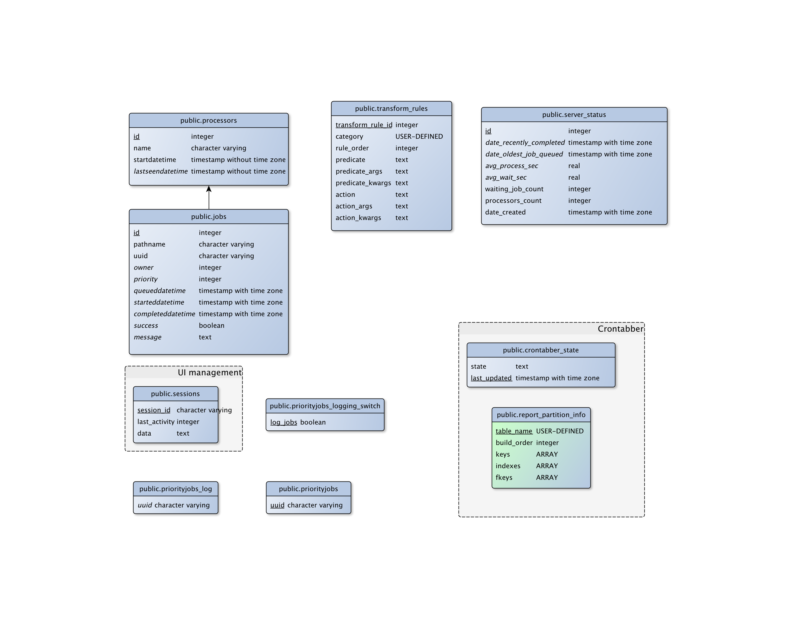
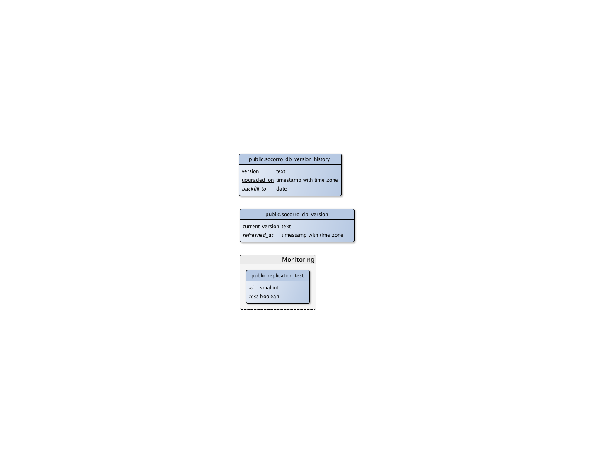

.. _database-chapter:

===================
PostgreSQL Database
===================

.. contents::

FIXME(willkg): This needs to be overhauled, updated, and reduced.

Postgres Database Setup and Operation
=====================================

There are three major steps in creating a Socorro database for production:

* Run ``socorro setupdb``
* Create a new product (currently not automated)
* Run crontabber jobs to normalize incoming crash and product data

socorro setupdb
---------------

``socorro setupdb`` is an application that will set up the Postgres database
schema for Socorro. It starts with an empty database and creates all the tables,
indexes, constraints, stored procedures and triggers needed to run a Socorro
instance.

You have to set up a regular user for day-to-day operations. While it is not
recommended that the regular user have the full set of super user privileges,
the regular user must be privileged enough to create tables within the database.

This tool also requires a user with superuser permissions if you want to be able
to run the script without logging into the database and first creating a
suitable database and if you want to use the ``--dropdb`` option.

This script also requires an ``alembic`` configuration file for initializing our
database migration system. An example configuration file can be found in
``config/alembic.ini-dist``.

Run it like this::

  socorro setupdb --database_name=mydatabasename --createdb

Common options listed below::

  --fakedata -- populate the database with preset fixture data
  --fakedata_days=2 -- the number of days worth of crash data to generate
  --dropdb -- drop a database with the same name as --database_name

For more information about fakedata, see ``socorro/external/postgresql/fakedata.py``.

Creating a new product
----------------------

Current (as of 2/4/2015)

There is work underway to automate adding a new product.

The minimal set of actions to enable products viewable in the Django webapp is:

1. ``SELECT add_new_product()`` in the Postgres database
2. ``SELECT add_new_release()`` in the Postgres database
3. Insert channels into ``product_release_channels``
4. ``SELECT update_product_versions()`` in the Postgres database
5. ``service memcached restart`` on your memcached server

Details on the Postgres related operations are below.

**``SELECT add_new_product()``**

This function adds rows to the ``products``, ``product_build_types``, and
``product_productid_map`` tables.

Minimum required to call this function::

    SELECT add_new_product('MyNewProduct', '1.0');

The first value is the product name, used in the webapp and other places for
display. Currently we require that this have no spaces. We'd welcome a pull
request to make whitespace in a product name possible in our Django webapp.

The second value is the product initial version. This should be the minimum
version number that you'll receive crashes for in dotted notation. This is
currently a DOMAIN, and has some special type checking associated with it. In
the future, we may change this to be NUMERIC type so as to make it easier to
work with across ORMs and with Python.

Additional options include::

  prodid TEXT -- a UUID surrounded by '{}' used by Mozilla for Firefox and other products
  ftpname TEXT -- an alternate name used to match the product name as given by our release metadata server (ftp and otherwise)
  release_throttle NUMERIC -- used by our collectors to only process a percentage of all crashes, a percentage
  rapid_beta_version NUMERIC -- documents the first release version that supports the 'rapid_beta' feature for Socorro

These options are not required and have suitable defaults for all installations.

**``SELECT add_new_release()``**

This function adds new rows to ``releases_raw`` table, and optionally adds new
rows to ``product_versions``.

Minimum required to call this function::

    SELECT add_new_release('MyNewProduct', '1.0', 'release', '201501010000', 'Linux');

The first value is product name and must match either the product name or
ftpname from the ``add_new_product()`` function run (or whatever is in the
products table).

The second value is a version, and this must be numerically equal to or less
than the major version added during the ``add_new_product()`` run. We support
several common alphanumeric versioning schemes. Examples of supported version
numbers::

    1.0.1
    1.0a1
    1.0b10
    1.0.6esr
    1.0.10pre
    1.0.3(beta)

The third value is a release_channel. Our supported release channel types
currently include: release, nightly, aurora (aka alpha), beta, esr (extended
support release). "pre" is mapped to "aurora". Rules for support of "nightly"
release channels are complicated.

If you need to support release channels in addition or with names different than
our defaults, you may need to modify the ``build_type`` ENUM defined in the
database. There are a number of other dependencies out of scope for this
document. Recommendation at this time is to just use our release_channels.

The fourth value is a build identifier. Our builds are typically identified by a
timestamp.

The fifth value is an operating system name. Supported operating systems are:
Windows, Mac OS X and Linux. There are a few caveats to Windows naming with the
tables ``os_name``, ``os_versions`` and ``os_name_matches`` playing important
roles in our materialized view generation.

Additional options include::

  beta_number INTEGER -- a number derived from the version_string if passed in to help sort betas when displayed
  repository TEXT -- an label indicating of where the release came from, often same name as an FTP repo
  version_build TEXT -- a label to help identify specific builds associated with the version string
  update_products (True/False) -- calls update_product_versions() for you
  ignore_duplicates (True/False) -- catches UNIQUE violations

**Insert channels into ``product_release_channels``**

Here is a a SQL command to populate this table::

  INSERT into product_release_channels
  (product_name, release_channel, throttle)
  VALUES
  ('MyNewProduct', 'release', '0.1');

The first value is product name and must match either the product name or
ftpname from the ``add_new_product()`` function run (or whatever is in the
products table).

The second value is a release_channel. Our supported release channel types
currently include: release, nightly, aurora (aka alpha), beta, esr (extended
support release). "pre' is mapped to 'aurora'. Rules for support of 'nightly'
release channels are complicated.

The third value is release_throttle and is a NUMERIC value indicating what
percentage of crashes are processed.

**``SELECT update_product_versions()``**

This function inserts rows into the ``product_versions`` and ``product_version_builds`` tables.

Minimum required to call this function::

  SELECT update_product_versions();

No values need to be passed to the function by default.

Options include::

  product_window INTEGER -- the number of days you'd like product versions to be inserted and updated for, default is 30 days

Database Schema
===============

Introduction
------------

Socorro operation is deeply connected to the PostgreSQL database: It makes use
of a significant number of PostgreSQL and psycopg2 (python) features and
extensions. Making a database-neutral API has been explored, and for now is not
being pursued.

The tables can be divided into three major categories: crash data, aggregate
reporting and process control.

Core crash data diagram
-----------------------

.. image:: core-socorro.png
   :width: 600px

**reports**

This table participates in DatabasePartitioning

Holds a lot of data about each crash report::

                                            Table "public.reports"
           Column        |           Type           |                      Modifiers
    ---------------------+--------------------------+------------------------------------------------------
     id                  | integer                  | not null default nextval('reports_id_seq'::regclass)
     client_crash_date   | timestamp with time zone |
     date_processed      | timestamp with time zone |
     uuid                | character varying(50)    | not null
     product             | character varying(30)    |
     version             | character varying(16)    |
     build               | character varying(30)    |
     signature           | character varying(255)   |
     url                 | character varying(255)   |
     install_age         | integer                  |
     last_crash          | integer                  |
     uptime              | integer                  |
     cpu_name            | character varying(100)   |
     cpu_info            | character varying(100)   |
     reason              | character varying(255)   |
     address             | character varying(20)    |
     os_name             | character varying(100)   |
     os_version          | character varying(100)   |
     email               | character varying(100)   |
     user_id             | character varying(50)    |
     started_datetime    | timestamp with time zone |
     completed_datetime  | timestamp with time zone |
     success             | boolean                  |
     truncated           | boolean                  |
     processor_notes     | text                     |
     user_comments       | character varying(1024)  |
     app_notes           | character varying(1024)  |
     distributor         | character varying(20)    |
     distributor_version | character varying(20)    |
     topmost_filenames   | text                     |
     addons_checked      | boolean                  |
     flash_version       | text                     |
     hangid              | text                     |
     process_type        | text                     |
     release_channel     | text                     |
     productid           | text                     |

Indexes and FKs from a child table::

    Indexes:
        "reports_20121015_pkey" PRIMARY KEY, btree (id)
        "reports_20121015_unique_uuid" UNIQUE, btree (uuid)
        "reports_20121015_build_key" btree (build)
        "reports_20121015_date_processed_key" btree (date_processed)
        "reports_20121015_hangid_idx" btree (hangid)
        "reports_20121015_product_version_key" btree (product, version)
        "reports_20121015_reason" btree (reason)
        "reports_20121015_signature_date_processed_build_key" btree (signature, date_processed, build)
        "reports_20121015_url_key" btree (url)
        "reports_20121015_uuid_key" btree (uuid)
    Check constraints:
        "reports_20121015_date_check" CHECK ('2012-10-15 00:00:00+00'::timestamp with time zone <= date_processed AND date_processed < '2012-10-22 00:00:00+00'::timestamp with time z
    one)
    Referenced by:
        TABLE "extensions_20121015" CONSTRAINT "extensions_20121015_report_id_fkey" FOREIGN KEY (report_id) REFERENCES reports_20121015(id) ON DELETE CASCADE
        TABLE "plugins_reports_20121015" CONSTRAINT "plugins_reports_20121015_report_id_fkey" FOREIGN KEY (report_id) REFERENCES reports_20121015(id) ON DELETE CASCADE
    Inherits: reports

**extensions**

This table participates in [[DatabasePartitioning]].

Holds data about what extensions are associated with a given report::

                    Table "public.extensions"
          Column       |           Type           | Modifiers
    -------------------+--------------------------+-----------
     report_id         | integer                  | not null
     date_processed    | timestamp with time zone |
     extension_key     | integer                  | not null
     extension_id      | text                     | not null
     extension_version | text                     |

Partitioned Child Table::

    Indexes:
        "extensions_20121015_pkey" PRIMARY KEY, btree (report_id, extension_key)
        "extensions_20121015_extension_id_extension_version_idx" btree (extension_id, extension_version)
        "extensions_20121015_report_id_date_key" btree (report_id, date_processed, extension_key)
    Check constraints:
        "extensions_20121015_date_check" CHECK ('2012-10-15 00:00:00+00'::timestamp with time zone <= date_processed AND date_processed < '2012-10-22 00:00:00+00'::timestamp with time zone)
    Foreign-key constraints:
        "extensions_20121015_report_id_fkey" FOREIGN KEY (report_id) REFERENCES reports_20121015(id) ON DELETE CASCADE
    Inherits: extensions

Materialized View Reporting
---------------------------

 .. image:: matviews-socorro.png
	:width: 600px

Monitor, Processors and crontabber tables
------------------------------------------

Needs significant update (2015/02/04)

Admin tables
------------

PostgreSQL Database Tables by Data Source
=========================================

Last updated: 2012-10-22

This document breaks down the tables in the Socorro PostgreSQL database by where their data comes from, rather than by what the table contains.  This is a prerequisite to populating a brand-new socorro database or creating synthetic testing workloads.

Manually Populated Tables
-------------------------

The following tables have no code to populate them automatically.  Initial population and any updating need to be done by hand.  Generally there's no UI, either; use queries.

* crash_types
* os_name_matches
* os_names
* product_productid_map
* process_types
* product_release_channels
* products
* release_channel_matches
* release_channels
* report_partition_info
* uptime_levels
* windows_versions

Tables Receiving External Data
------------------------------

These tables actually get inserted into by various external utilities. This is
most of our "incoming" data.

bugs
	list of bugs, populated by socorro/cron/bugzilla.py

bugs_associations
	bug to signature association, populated by socorro/cron/bugzilla.py

extensions
	populated by processors

plugins
  populated by processors based on crash data

plugins_reports
	populated by processors

raw_adi
    populated by daily batch job that selects ADI from Hive system backed by SEQ files
    from load balancers

releases_raw
	populated by daily FTP-scraper

reports
	populated by processors

Automatically Populated Reference Tables
----------------------------------------

Lookup lists and dimension tables, populated by cron jobs and/or processors
based on the above tables. Most are annotated with the job or process which
populates them. Where the populating process is marked with an @, that indicates
a job which is due to be phased out.

addresses
  cron job, by update_lookup_new_reports, part of update_reports_clean based on reports

domains
  cron job, by update_lookup_new_reports, part of update_reports_clean based on reports

flash_versions
  cron job, by update_lookup_new_reports, part of update_reports_clean based on reports

os_versions
  cron job, update_os_versions_new_reports, based on reports@
  cron job, update_reports_clean based on reports

product_version_builds
  cron job, update_product_versions, based on releases_raw

product_versions
  cron job, update_product_versions, based on releases_raw

reasons
  cron job, update_reports_clean, based on reports

reports_bad
  cron job, update_reports_clean, based on reports
  future cron job to delete data from this table

signatures
  cron job, update_signatures, based on reports@
  cron job, update_reports_clean, based on reports

Matviews
--------

Reporting tables, designed to be called directly by the mware/UI/reports.
Populated by cron job batch. Where populating functions are marked with a @,
they are due to be replaced with new jobs.

bug_associations
  not sure

build_adu
  daily adu based on raw_adi for builds

daily_hangs
  update_hang_report based on reports

product_adu
  daily adu based on raw_adi for products

reports_clean
  update_reports_clean based on reports

reports_user_info
  update_reports_clean based on reports

reports_duplicates
  find_reports_duplicates based don reports

signature_products
  update_signatures based on reports@

signature_products_rollup
  update_signatures based on reports@

tcbs
  update_tcbs based on reports

Application Management Tables
-----------------------------

These tables are used by various parts of the application to do other things
than reporting. They are populated/managed by those applications.

* email campaign tables

  * email_campaigns
  * email_campaigns_contacts
  * email_contacts

* processor management tables

  * processors
  * transform_rules

* UI management tables

  * sessions

* monitoring tables

  * replication_test

* cronjob and database management

  * cronjobs
  * report_partition_info

PostgreSQL Database Table Descriptions
======================================

This document describes the various tables in PostgreSQL by their purpose and
essentially what data each contains. This is intended as a reference for socorro
developers and analytics users.

Tables which are in the database but not listed below are probably legacy tables
which are slated for removal in future Socorro releases. Certainly if the tables
are not described, they should not be used for new features or reports.

Raw Data Tables
---------------

These tables hold "raw" data as it comes in from external sources. As such,
these tables are quite large and contain a lot of garbage and data which needs
to be conditionally evaluated. This means that you should avoid using these
tables for reports and interfaces unless the data you need isn't available
anywhere else -- and even then, you should see about getting the data added to a
matview or normalized fact table.

*reports*

The primary "raw data" table, reports contains the most used information about
crashes, one row per crash report. Primary key is the UUID field.

The reports table is partitioned by date_processed into weekly partitions, so
any query you run against it should include filter criteria (WHERE) on the
date_processed column. Examples:

::

	WHERE date_processed BETWEEN '2012-02-12 11:05:09+07' AND '2012-02-17 11:05:09+07'
	WHERE date_processed >= DATE '2012-02-12' AND date_processed < DATE '2012-02-17'
	WHERE utc_day_is(date_processed, '2012-02-15')

Data in this table comes from the processors.

*extensions*

Contains information on add-ons installed in the user's application. Currently
linked to reports via a synthetic report_id (this will be fixed to be UUID in
some future release). Data is partitioned by date_processed into weekly
partitions, so include a filter on date_processed in every query hitting this
table. Has zero to several rows for each crash. This is used by correlations.

Data in this table comes from the processors.

*plugins_reports*

Contains information on some, but not all, installed modules implicated in the
crash: the "most interesting" modules. Relates to dimension table plugins.
Currently linked to reports via a synthetic report_id (this will be fixed to be
UUID in some future release). Data is partitioned by date_processed into weekly
partitions, so include a filter on date_processed in every query hitting this
table. Has zero to several rows for each crash.

Data in this table comes from the processors.

*bugs*

Contains lists of bugs thought to be related to crash reports, for linking to
crashes. Populated by a daily cronjob.

*bug_associations*

Links bugs from the bugs table to crash signatures.  Populated by daily cronjob.

*raw_adi*

Contains counts of estimated Average Daily Users as calculated by the Metrics
department, grouped by product, version, build, os, and UTC date. Populated by a
daily cronjob.

*releases_raw*

Contains raw data about Mozilla releases, including product, version, platform
and build information. Populated hourly via FTP-scraping.

*reports_duplicates*

Contains UUIDs of groups of crash reports thought to be duplicates according to
the current automated duplicate-finding algorithm. Populated by hourly cronjob.

Normalized Fact Tables
----------------------

*reports_clean*

Contains cleaned and normalized data from the reports table, including
product-version, os, os version, signature, reason, and more. Partitioned by
date into weekly partitions, so each query against this table should contain a
predicate on date_processed:

::

	WHERE date_processed BETWEEN '2012-02-12 11:05:09+07' AND '2012-02-17 11:05:09+07'
	WHERE date_processed >= DATE '2012-02-12' AND date_processed < DATE '2012-02-17'
	WHERE utc_day_is(date_processed, '2012-02-15')

Because reports_clean is much smaller than reports and is normalized into
unequivocal relationships with dimenstion tables, it is much easier to use and
faster to execute queries against. However, it excludes data in the reports
table which doesn't conform to normalized data, including:

* product versions before the first Rapid Release versions (e.g. Firefox 3.6)
* non-rapid release products
* corrupt reports, including ones which indicate a breakpad bug

Populated hourly, 3 hours behind the current time, from data in reports via
cronjob. The UUID column is the primary key. There is one row per crash report,
although some crash reports are suspected to be duplicates.

Updated by ``update_reports_clean()``.

Columns:

uuid
	artificial unique identifier assigned by the collectors to the crash at
	collection time. Contains the date collected plus a random string.

date_processed
    timestamp (with time zone) at which the crash was received by the
    collectors. Also the partition key for partitioning reports_clean. Note that
    the time will be 7-8 hours off for crashes before February 2012 due to a
    shift from PST to UTC.

client_crash_date
    timestamp with time zone at which the users' crashing machine though the
    crash was happening. Often innacurrate due to clock issues, is primarily
    supplied as an anchor timestamp for uptime and install_age.

product_version_id
	foreign key to the product_versions table.

build
    numeric build identifier as supplied by the client. Might not match any real
    build in product_version_builds for a variety of reasons.

signature_id
	foreign key to the signatures dimension table.

install_age
    time interval between installation and crash, as reported by the client. To
    get the reported install date, do ``( SELECT client_crash_date - install_age )``.

uptime
	time interval between program start and crash, as reported by the client.

reason_id
	foreign key to the reasons table.

address_id
	foreign key to the addresses table.

os_name
	name of the OS of the crashing host, for OSes which match known OSes.

os_version_id
	foreign key to the os_versions table.

hang_id
    UUID assigned to the hang pair grouping for hang pairs. May not match
    anything if the hang pair was broken by sampling or lost crash reports.

flash_version_id
	foreign key to the flash_versions table

process_type
	Crashing process type, linked to process_types dimension.

release_channel
    release channel from which the crashing product was obtained, unless altered
    by the user (this happens more than you'd think). Note that non-Mozilla
    builds are usually lumped into the "release" channel.

duplicate_of
    UUID of the "leader" of the duplicate group if this crash is marked as a
    possible duplicate. If UUID and duplicate_of are the same, this crash is the
    "leader". Selection of leader is arbitrary.

domain_id
	foreign key to the domains dimension

architecture
	CPU architecture of the client as reported (e.g. 'x86', 'arm').

cores
	number of CPU cores on the client, as reported.

*reports_user_info*

Contains a handful of "optional" information from the reports table which is
either security-sensitive or is not included in all reports and is large. This
includes the full URL, user email address, comments, and app_notes. As such,
access to this table in production may be restricted.

Partitioned by date into weekly partitions, so each query against this table
should contain a predicate on date_processed. Relates to reports_clean via UUID,
which is also its primary key.

Updated by update_reports_clean().

*product_adu*

The normalized version of raw_adi, contains summarized estimated counts of users
for each product-version since Rapid Release began. Populated by daily cronjob.

Updated by update_adu().

Dimensions
----------

These tables contain lookup lists and taxonomy for the fact tables in Socorro.
Generally they are auto-populated based on encountering new values in the raw
data, on an hourly basis. A few tables below are manually populated and change
extremely seldom, if at all.

Dimensions which are lookup lists of short values join to the fact tables by
natural key, although it is not actually necessary to reference them (e.g.
os_name, release_channel). Dimension lists which have long values or are
taxonomies or heirarchies join to the fact tables using a surrogate key (e.g.
product_version_id, reason_id).

Some dimensions which come from raw crash data have a "first_seen" column which
displays when that value was first encountered in a crash and added to the
dimension table. Since the first_seen columns were added in September 2011, most
of these will have the value '2011-01-01' which is not meaningful. Only dates
after 2011-09-15 actually indicate a first appearance.

*addresses*

Contains a list of crash location "addresses", extracted hourly from the raw
data. Surrogate key: address_id.

Updated by update_reports_clean().

*crash_types*

Intersects process_types and whether or not a crash is a hang to supply 5
distinct crash types. Used for the "Crashes By User" screen.

Updated manually.

*domains*

List of HTTP domains extracted from raw reports by applying a truncation regex
to the crashing URL. These should contain no personal information. Contains a
"first seen" column. Surrogate key: domain_id

Updated from update_reports_clean(), with function update_lookup_new_reports().

*flash_versions*

List of Abobe Flash version numbers harvested from crashes. Has a "first_seen"
column. Surrogate key: flash_version_id.

Updated from update_reports_clean(), with function update_lookup_new_reports().

*os_names*

Canonical list of OS names used in Sorocco.  Natural key.  Fixed list.

Updated manually.

*os_versions*

List of versions for each OS based on data harvested from crashes. Contains some
garbage versions because we cannot validate. Surrogate key: os_version_id.

Updated from update_reports_clean(), with function
update_os_versions_new_reports().

*plugins*

List of "interesting modules" harvested from raw crashes, populated by the
processors. Surrogate key: ID. Links to plugins_reports.

*process_types*

Standing list of crashing process types (browser, plugin and hang). Natural key.

Updated manually.

*products*

List of supported products, along with the first version on rapid release.
Natural key: product_name.

Updated manually.

*product_versions*

Contains a list of versions for each product, since the beginning of rapid
release (i.e. since Firefox 5.0). Version numbers are available expressed
several different ways, and there is a sort column for sorting versions. Also
contains build_date/sunset_date visibility information and the featured_version
flag. "build_type" means the same thing as "release_channel". Surrogate key:
product_version_id.

Updated by update_product_versions(), based on data from releases_raw.

Version columns include:

version_string
	The canonical, complete version number for display to users

release_version
    The version number as provided in crash reports (and usually the same as the
	one on the FTP server). Can be missing suffixes like "b2" or "esr".

major_version
	Just the first two numbers of the version number, e.g. "11.0"

version_sort
	An alphanumeric string which allows you to sort version numbers in
	the correct order.

beta_number
	The sequential beta release number if the product-version is a beta.
	For "final betas", this number will be 99.

*product_version_builds*

Contains a list of builds for each product-version. Note that platform
information is not at all normalized. Natural key: product_version_id, build_id.

Updated from update_os_versions_new_reports().

*product_release_channels*

Contains an intersection of products and release channels, mainly in order to
store throttle values. Manually populated. Natural key: product_name,
release_channel.

*reasons*

Contains a list of "crash reason" values harvested from raw crashes. Has a
"first seen" column. Surrogate key: reason_id.

*release_channels*

Contains a list of available Release Channels. Manually populated. Natural key.
See "note on release channel columns" below.

*signatures*

List of crash signatures harvested from incoming raw data. Populated by hourly
cronjob. Has a first_seen column. Surrogate key: signature_id.

*uptime_levels*

Reference list of uptime "levels" for use in reports, primarily the Signature
Summary. Manually populated.

*windows_versions*

Reference list of Window major/minor versions with their accompanying common
names for reports. Manually populated.

Matviews
--------

These data summaries are derived data from the fact tables and/or the raw data
tables. They are populated by hourly or daily cronjobs, and are frequently
regenerated if historical data needs to be corrected. If these matviews contain
the data you need, you should use them first because they are smaller and more
efficient than the fact tables or the raw tables.

*build_adu*

Totals ADU per product-version, OS, crash report date, and build date. Used
primarily to feed data to crashes_by_user_build and home_page_build.

*correlations*

Summaries crashes by product-version, os, reason and signature. Populated by
daily cron job. Is the root for the other correlations reports. Correlation
reports in the database will not be active/populated until 2.5.2 or later.

*correlation_addons*

Contains crash-count summaries of addons per correlation. Populated by daily
cronjob.

*correlation_cores*

Contains crash-count summaries of crashes per architecture and number of cores.
Populated by daily cronjob.

*correlation_modules*

Will contain crash-counts for modules per correlation. Will be populated daily
by pull from S3.

*crashes_by_user, crashes_by_user_view*

Totals crashes, adu, and crash/adu ratio for each product-version, crash type
and OS for each crash report date. Used to populate the "Crashed By User"
interactive graph. crashes_by_user_view joins crashes_by_user to its various
lookup list tables.

*crashes_by_user_build, crashes_by_user_build_view*

The same as crashes_by_user, but also summarizes by build_date, allowing you to
do a sum() and see crashes by build date instead of by crash report date.

*daily_hangs and hang_report*

daily_hangs contains a correlation of hang crash reports with their related hang
pair crashes, plus additional summary data. Duplicates contains an array of
UUIDs of possible duplicates.

hang_report is a dynamic view which flattens daily_hangs and its related
dimension tables.

*home_page_graph, home_page_graph_view*

Summary of non-browser-hang crashes by report date and product-version,
including ADU and crashes-per-hundred-adu. As the name suggests, used to
populate the home page graph. The _view joins the matview to its various lookup
list tables.

*home_page_graph_build, home_page_graph_build_view*

Same as home_page_graph, but also includes build_date. Note that since it
includes report_date as well as build_date, you need to do a SUM() of the counts
in order to see data just by build date.

*nightly_builds*

contains summaries of crashes-by-age for Nightly and Aurora releases. Will be
populated in Socorro 2.5.1.

*product_crash_ratio*

Dynamic VIEW which shows crashes, ADU, adjusted crashes, and the crash/100ADU
ratio, for each product and versions. Recommended for backing graphs and
similar.

*product_os_crash_ratio*

Dynamic VIEW which shows crashes, ADU, adjusted crashes, and the crash/100ADU
ratio for each product, OS and version. Recommended for backing graphs and
similar.

*product_info*

dynamic VIEW which suppies the most essential information about each product
version for both old and new products.

*signature_products and signature_products_rollup*

Summary of which signatures appear in which product_version_ids, with first
appearance dates.

The rollup contains an array-style summary of the signatures with lists of
product-versions.

*tcbs*

Short for "Top Crashes By Signature", tcbs contains counts of crashes per day,
signature, product-version, and columns counting each OS.

*tcbs_build*

Same as TCBS, only with build_date as well. Note that you need to SUM() values,
since report_date is included as well, in order to get values just by build
date.

Note On Release Channel Columns
-------------------------------

Due to a historical error, the column name for the Release Channel in various
tables may be named "release_channel", "build_type", or "build_channel". All
three of these column names refer to exactly the same thing. While we regret the
confusion, it has not been thought to be worth the refactoring effort to clean
it up.

Application Support Tables
--------------------------

These tables are used by various parts of the application to do other things
than reporting. They are populated/managed by those applications. Most are not
accessible to the various reporting users, as they do not contain reportable
data.

*data processing control tables*

These tables contain data which supports data processing by the processors and
cronjobs.

product_productid_map
	maps product names based on productIDs, in cases where the product name
	supplied by Breakpad is not correct (i.e. FennecAndroid).

reports_bad
	contains the last day of rejected UUIDs for copying from reports to
	reports_clean.  intended for auditing of the reports_clean code.

os_name_matches
	contains regexs for matching commonly found OS names in crashes with
	canonical OS names.

release_channel_matches
	contains LIKE match strings for release channels for channel names
	commonly found in crashes with canonical names.

special_product_platforms
	contains mapping information for rewriting data from FTP-scraping
	to have the correct product and platform.  Currently used only
	for Fennec.

transform_rules
	contains rule data for rewriting crashes by the processors.  May be
	used in the future for other rule-based rewriting by other components.

*email campaign tables*

These tables support the application which emails crash reporters with
follow-ups.  As such, access to these tables will restricted.

	* email_campaigns
	* email_campaigns_contacts
	* email_contacts

*processor management tables*

These tables are used to coordinate activities of the up-to-120 processors
and the monitor.

jobs
	The current main queue for crashes waiting to be processed.

priorityjobs
	The queue for user-requested "priority" crash processing.

processors
	The registration list for currently active processors.

*UI management tables*

sessions
	contains session information for people logged into the administration
	interface for Socorro.

*monitoring tables*

replication_test
	Contains a timestamp for ganglia to measure the speed of replication.

*cronjob and database management*

These tables support scheduled tasks which are run in Socorro.

report_partition_info
	contains configuration information on how the partitioning cronjob
	needs to partition the various partitioned database tables.

socorro_db_version
	contains the socorro version of the current database.  updated by the
	upgrade scripts.

socorro_db_version_history
	contains the history of version upgrades of the current database.

Creating a New Matview
======================

A materialized view, or "matview" is the results of a query stored as a table in
the PostgreSQL database. Matviews make user interfaces much more responsive by
eliminating searches over many GB or sparse data at request time. The majority
of the time, new matviews will have the following characteristics:

* they will pull data from reports_clean and/or reports_user_info
* they will be updated once per day and store daily summary data
* they will be updated by a cron job calling a stored procedure

The rest of this guide assumes that all three conditions above are true. For
matviews for which one or more conditions are not true, consult the PostgreSQL
DBAs for your matview.

Do I Want a Matview?
--------------------

Before proceeding to construct a new matview, test the responsiveness of simply
running a query over reports_clean and/or reports_user_info. You may find that
the query returns fast enough ( < 100ms ) without its own matview. Remember to
test the extreme cases: Firefox release version on Windows, or Fennec aurora
version.

Also, matviews are really only effective if they are smaller than 1/4 the size
of the base data from which they are constructed. Otherwise, it's generally
better to simply look at adding new indexes to the base data. Try populating a
couple days of the matview, ad-hoc, and checking its size
(pg_total_relation_size()) compared to the base table from which it's drawn. The
new signature summaries was a good example of this; the matviews to meet the
spec would have been 1/3 the size of reports_clean, so we added a couple new
indexes to reports_clean instead.

Components of a Matview
-----------------------

In order to create a new matview, you will create or modify five or six things:

1. a table to hold the matview data
2. an update function to insert new matview data once per day
3. a backfill function to backfill one day of the matview
4. add a line in the general backfill_matviews function
5. if the matview is to be backfilled from deployment, a script to do this
6. a test that the matview is being populated correctly.

The final point is not yet addressed by a test framework for Socorro, so we're
skipping it currently.

For the rest of this doc, please refer to the template matview code
sql/templates/general_matview_template.sql in the Socorro source code.

Creating the Matview Table
--------------------------

The matview table should be the basis for the report or screen you want. It's
important that it be able to cope with all of the different filter and grouping
criteria which users are allowed to supply. On the other hand, most of the time
it's not helpful to try to have one matview support several different reports;
the matview gets bloated and slow.

In general, each matview will have the following things:

* one or more grouping columns
* a report_date column
* one or more summary data columns

If they are available, all columns should use surrogate keys to lookup lists
(i.e. use signature_id, not the full text of the signature). Generally the
primary key of the matview will be the combination of all grouping columns plus
the report date.

So, as an example, we're going to create a simple matview for summarizing
crashes per product, web domain. While it's unlikely that such a matview would
be useful in practice (we could just query reports_clean directly) it makes a
good example. Here's the model for the table:

::

	table product_domain_counts
		product_version
		domain
		report_date
		report_count
		key product_version, domain, report_date

We actually use the custom procedure create_table_if_not_exists() to create
this. This function handles idempotence, permissions, and secondary indexes for
us, like so:

::

	SELECT create_table_if_not_exists('product_domain_counts'
		$x$
		CREATE TABLE product_domain_counts (
			product_version_id INT NOT NULL,
			domain_id INT NOT NULL,
			report_date DATE NOT NULL,
			report_count INT NOT NULL DEFAULT 0,
			constraint product_domain_counts_key (
				product_version_id, domain_id, report_date )
			);
		$x$,
		'breakpad_rw', ARRAY['domain_id'] );

See DatabaseAdminFunctions in the docs for more information about the function.

You'll notice that the resulting matview uses the surrogate keys of the
corresponsing lookup lists rather than the actual values. This is to keep
matview sizes down and improve performance. You'll also notice that there are no
foriegn keys to the various lookup list tables; this is partly a performance
optimization, but mostly because, since matviews are populated by stored
procedure, validating input is not critical. We also don't expect to need
cascading updates or deletes on the lookup lists.

Creating The Update Function
----------------------------

Once you have the table, you'll need to write a function to be called by cron
once per day in order to populate the matview with new data.

This function will:

* be named update_{name_of_matview}
* take two parameters, a date and a boolean
* return a boolean, with true = success and ERROR = failure
* check if data it depends on is available
* check if it's already been run for the day
* pull its data from reports_clean, reports_user_info, and/or other matviews
  (_not_ reports or other raw data tables)

So, here's our update function for the product_domains table:

::

	CREATE OR REPLACE FUNCTION update_product_domain_counts (
		updateday DATE, checkdata BOOLEAN default TRUE )
	RETURNS BOOLEAN
	LANGUAGE plpgsql
	SET work_mem = '512MB'
	SET temp_buffers = '512MB'
	SET client_min_messages = 'ERROR'
	AS $f$
	BEGIN
	-- this function populates a daily matview
	-- for crash counts by product and domain
	-- depends on reports_clean

	-- check if we've been run
	IF checkdata THEN
		PERFORM 1 FROM product_domain_counts
		WHERE report_date = updateday
		LIMIT 1;
		IF FOUND THEN
			RAISE EXCEPTION 'product_domain_counts has already been run for %.',updateday;
		END IF;
	END IF;

	-- check if reports_clean is complete
	IF NOT reports_clean_done(updateday) THEN
		IF checkdata THEN
			RAISE EXCEPTION 'Reports_clean has not been updated to the end of %',updateday;
		ELSE
			RETURN TRUE;
		END IF;
	END IF;

	-- now insert the new records
	-- this should be some appropriate query, this simple group by
	-- is just provided as an example
	INSERT INTO product_domain_counts
		( product_version_id, domain_id, report_date, report_count )
	SELECT product_version_id, domain_id,
		updateday,
		count(*)
	FROM reports_clean
	WHERE domain_id IS NOT NULL
		AND date_processed >= updateday::timestamptz
		AND date_processed < ( updateday + 1 )::timestamptz
	GROUP BY product_version_id, domain_id;

	RETURN TRUE;
	END; $f$;

Note that the update functions could be written in PL/python if you wish;
however, there isn't yet a template for that.

Creating The Backfill Function
------------------------------

The second function which needs to be created is one for backfilling data for
specific dates, for when we need to backfill missing or corrected data. This
function will also be used to fill in data when we first deploy the matview.

The backfill function will generally be very simple; it just calls a delete for
the days data and then the update function, with the "checkdata" flag disabled:

::

	CREATE OR REPLACE FUNCTION backfill_product_domain_counts(
		updateday DATE )
	RETURNS BOOLEAN
	LANGUAGE plpgsql AS
	$f$
	BEGIN

	DELETE FROM product_domain_counts WHERE report_date = updateday;
	PERFORM update_product_domain_counts(updateday, false);

	RETURN TRUE;
	END; $f$;

Adding The Function To The Omnibus Backfill
-------------------------------------------

Usually when we backfill data we recreate all matview data for the period
affected. This is accomplished by inserting it into the backfill_matviews table:

::

	INSERT INTO backfill_matviews ( matview, function_name, frequency )
	VALUES ( 'product_domain_counts', 'backfill_product_domain_counts', 'daily' );

NOTE: the above is not yet active. Until it is, send a request to Josh Berkus to
add your new backfill to the omnibus backfill function.

Filling in Initial Data
-----------------------

Generally when creating a new matview, we want to fill in two weeks or so of
data. This can be done with either a Python or a PL/pgSQL script. A PL/pgSQL
script would be created as a SQL file and look like this:

::

	DO $f$
	DECLARE
		thisday DATE := '2012-01-14';
		lastday DATE;
	BEGIN

		-- set backfill to the last day we have ADI for
		SELECT max("date")
		INTO lastday
		FROM raw_adi;

		WHILE thisday <= lastday LOOP

			RAISE INFO 'backfilling %', thisday;

			PERFORM backfill_product_domain_counts(thisday);

			thisday := thisday + 1;

		END LOOP;

	END;$f$;

This script would then be checked into the set of upgrade scripts for that
version of the database.

Database Admin Function Reference
=================================

What follows is a listing of custom functions written for Socorro in the
PostgreSQL database which are intended for database administration, particularly
scheduled tasks. Many of these functions depend on other, internal functions
which are not documented.

All functions below return BOOLEAN, with TRUE meaning completion, and throw an
ERROR if they fail, unless otherwise noted.

MatView Functions
-----------------

These functions manage the population of the many Materialized Views in Socorro.
In general, for each matview there are two functions which maintain it. In the
cases where these functions are not listed below, assume that they fit this
pattern.

::

	update_{matview_name} (
		updateday DATE optional default yesterday,
		checkdata BOOLEAN optional default true,
		check_period INTERVAL optional default '1 hour'
		)

	fills in one day of the matview for the first time
	will error if data is already present, or source data
	is missing

	backfill_{matview_name} (
		updateday DATE optional default yesterday,
		checkdata BOOLEAN optional default true,
		check_period INTERVAL optional default '1 hour'
		)

	deletes one day of data for the matview and recreates
	it.  will warn, but not error, if source data is missing
	safe for use without downtime

More detail on the parameters:

updateday
	UTC day to run the update/backfill for.  Also the UTC day
	to check for conflicting or missing dependant data.

checkdata
	Whether or not to check for conflicting data (i.e. has this
	already been run?), and for missing upstream data needed to
	run the fill.  If checkdata=false, function will just emit
	NOTICEs and return FALSE if upstream data is not present.

check_period
	For functions which depend on reports_clean, the window of
	reports_clean to check for data being present.  This is because
	at Mozilla we check to see that the last hour of reports_clean
	is filled in, but open source users need a larger window.

Matview functions return a BOOLEAN which will have one of three results: TRUE,
FALSE, or ERROR. What these mean generally depend on whether or not
checkdata=on. It also returns an error string which gives more information about
what it did.

If checkdata=TRUE (default):

TRUE
	matview function ran and filled in data.

FALSE
	matview update has already been run for the relevant period.
	no changes to data made, and warning returned.

ERROR
	underlying data is missing (i.e. no crashes, no raw_adi, etc.)
	or some unexpected error condition

IF checkdata=FALSE:

TRUE
	matview function ran and filled in data.

FALSE
	matview update has already been run for the relevant period,
	or source data (crashes, adu, etc.) is missing.
	no changes to data made, and no warning made.

ERROR
	some unexpected error condition.

Or, as a grid of results (where * indicates that a warning message is returned
as well):

==============  =======  =======
Matview Proc        CheckData
--------------  ----------------
Condition        TRUE     FALSE
==============  =======  =======
Success          TRUE	  TRUE
Already Run      FALSE*   FALSE
No Source Data   ERROR*   FALSE*
Other Issue      ERROR*   ERROR*
==============  =======  =======

Exceptions to the above are generally for procedures which need to run hourly or
more frequently (e.g. update_reports_clean, reports_duplicates). Also, some
functions have shortcut names where they don't use the full name of the matview
(e.g. update_adu).

Note that the various matviews can take radically different amounts of time to
update or backfill ... from a couple of seconds to 10 minutes for one day.

In addition, there are several procedures which are designed to update or
backfill multiple matviews for a range of days. These are designed for when
there has been some kind of widespread issue in crash processing and a bunch of
crashes have been reprocessed and need to be re-aggregated.

These mass-backfill functions generally give a lot of command-line feedback on
their progress, and should be run in a screen session, as they may take hours to
complete. These functions, as the most generally used, are listed first. If you
are doing a mass-backfill, you probably want to limit the backfill to a week at
a time in order to prevent it from running too long before committing.

Hourly Matview Update Functions
-------------------------------

These need to be run every hour, for each hour. None of them take the standard
parameters.

.. csv-table::
	:header: "Matview","Update Function","Backfill Function","Depends On","Notes"
	:widths: 20,30,30,30,20

	"reports_duplicates","update_reports_duplicates","backfill_reports_duplicates",,
	"reports_clean","update_reports_clean","backfill_reports_clean","reports_duplicates, product_version",
	"product_version","update_product_versions","update_product_versions","ftpscraper","Cumulative"

Since update_product_versions is cumulative, it needs to only be run once.

Daily Matview Update Functions
------------------------------

These daily functions generally accept the parameters given above. Unless
otherwise noted, all of them depend on all of the hourly functions having
completed for the day.

.. csv-table::
	:header: "Matview","Update Function","Backfill Function","Depends On","Notes"
	:widths: 20,30,30,30,20

	"build_adu","update_build_adu","backfill_build_adu","raw_adi fill",
	"product_adu","update_adu","backfill_adu","raw_adi fill",
	"crashes_by_user","update_crashes_by_user","backfill_crashes_by_user","update_adu",
	"crashes_by_user_build","update_crashes_by_user_build","backfill_crashes_by_user_build","update_build_adu",
	"correlations","update_correlations","backfill_correlations","NA","Last Day Only"
	"correlations_addons","update_correlations","backfill_correlations","NA","Last Day Only"
	"correlations_cores","update_correlations","backfill_correlations","NA","Last Day Only"
	"correlations_modules",,,,"Not working at present."
	"daily_hangs","update_hang_report","backfill_hang_report",,
	"home_page_graph","update_home_page_graph","backfill_home_page_graph","product_adu",
	"home_page_graph_build","update_home_page_graph_build","backfill_home_page_graph_build","build_adu",
	"nightly_builds","update_nightly_builds","backfill_nightly_builds",,
	"signature_products","update_signatures","backfill_signature_counts",,
	"signature_products_rollup","update_signatures","backfill_signature_counts",,
	"tcbs","update_tcbs","backfill_tcbs",,
	"tcbs_build","update_tcbs_build","backfill_tcbs_build",,
	"tcbs","Last Day Only"

Functions marked "last day only" do not accumulate data, but display it only for
the last day they were run. As such, there is no need to fill them in for each
day.

Other Matview Functions
-----------------------

Matview functions which don't fit the parameters above include:

backfill_matviews
-----------------

Purpose: backfills data for all matviews for a specific range of dates. For use
when data is either missing or needs to be retroactively corrected.

Called By: manually by admin as needed

::

  backfill_matviews (
    startdate DATE,
    optional enddate DATE default current_date,
    optional reportsclean BOOLEAN default true
  )

  SELECT backfill_matviews( '2011-11-01', '2011-11-27', false );
  SELECT backfill_matviews( '2011-11-01' );

startdate
  the first date to backfill

enddate
  the last date to backfill.  defaults to the current UTC date.

reportsclean
  whether or not to backfill reports_clean as well. defaults to true supplied
  because the backfill of reports_clean takes a lot of time.

backfill_reports_clean
----------------------

Purpose: backfill only the reports_clean normalized fact table.

Called By: admin as needed

::

	backfill_reports_clean (
		starttime TIMESTAMPTZ,
		endtime TIMESTAMPTZ,
	)

	SELECT backfill_reports_clean ( '2011-11-17', '2011-11-29 14:00:00' );

starttime
	timestamp to start backfill

endtime
	timestamp to halt backfill at

Note: if backfilling less than 1 day, will backfill in 1-hour increments. If
backfilling more than one day, will backfill in 6-hour increments. Can take a
long time to backfill more than a couple of days.

update_product_versions
-----------------------

Purpose: updates the list of product_versions and product_version_builds based
on the contents of releases_raw, products, release_repositories,
special_product_platforms, and for B2G: update_channel_map, raw_update_channels.

Called By: daily cron job

::

	update_product_versions (
        product_window INTEGER Default 30
		)

	SELECT update_product_versions ( );

Notes: takes no parameters as the product update is always cumulative and by
default is run daily. As of 2.3.5, only looks at product_versions with build
dates in the last 30 days. There is no backfill function because it is always a
cumulative update.

This function is complex. If implementing this outside of Mozilla, a user may
wish to create a simpler function that just inserts data into products and
product_versions.

update_rank_compare, backfill_rank_compare
------------------------------------------

Purpose: updates "rank_compare" based on the contents of the reports_clean table

Called By: daily cron job

Note: this matview is not historical, but contains only one day of data. As
such, running either the update or backfill function replaces all existing data.
Since it needs an exclusive lock on the matview, it is possible (though
unlikely) for it to fail to obtain the lock and error out.

reports_clean_done
------------------

Purpose: supports other admin functions by checking if reports_clean is complete
	to the end of the day.

Called By: other update functions

::

	reports_clean_done (
		updateday DATE,
		check_period INTERVAL optional default '1 hour'
		)

	SELECT reports_clean_done('2012-06-12');
	SELECT reports_clean_done('2012-06-12','12 hours');

Schema Management Functions
----------------------------

These functions support partitioning, upgrades, and other management of tables
and views.

weekly_report_partitions
------------------------

Purpose: to create new partitions for the reports table and its child tables
every week.

Called By: weekly cron job

::

	weekly_report_partitions (
		optional numweeks integer default 2,
		optional targetdate date default current_date
	)

	SELECT weekly_report_partitions();
	SELECT weekly_report_partitions(3,'2011-11-09');

numweeks
	number of weeks ahead to create partitions
targetdate
	date for the starting week, if not today

try_lock_table
--------------

Purpose: attempt to get a lock on a table, looping with sleeps until the lock is
obtained.

Called by: various functions internally

::

	try_lock_table (
		tabname TEXT,
		mode TEXT optional default 'EXCLUSIVE',
		attempts INT optional default 20
	) returns BOOLEAN

	IF NOT try_lock_table('rank_compare', 'ACCESS EXCLUSIVE') THEN
		RAISE EXCEPTION 'unable to lock the rank_compare table for update.';
	END IF;

tabname
	the table name to lock
mode
	the lock mode per PostgreSQL docs.  Defaults to 'EXCLUSIVE'.
attempts
	the number of attempts to make, with 3 second sleeps between each.
	optional, defaults to 20.

Returns TRUE for table locked, FALSE for unable to lock.

create_table_if_not_exists
--------------------------

Purpose: creates a new table, skipping if the table is found to already exist.

Called By: upgrade scripts

::

	create_table_if_not_exists (
		tablename TEXT,
		declaration TEXT,
		tableowner TEXT optional default 'breakpad_rw',
		indexes TEXT ARRAY default empty list
	)

	SELECT create_table_if_not_exists ( 'rank_compare', $q$
		create table rank_compare (
			product_version_id int not null,
			signature_id int not null,
			rank_days int not null,
			report_count int,
			total_reports bigint,
			rank_report_count int,
			percent_of_total numeric,
			constraint rank_compare_key primary key ( product_version_id, signature_id, rank_days )
		);$q$, 'breakpad_rw',
		ARRAY [ 'product_version_id,rank_report_count', 'signature_id' ]);

tablename
	name of the new table to create
declaration
	full CREATE TABLE sql statement, plus whatever other SQL statements you
	only want to run on table creation such as priming it with a few
	records and creating the primary key.  If running more than one
	SQL statement, separate them with semicolons.
tableowner
	the ROLE which owns the table.  usually 'breakpad_rw'.  optional.
indexes
	an array of sets of columns to create regular btree indexes on.
	use the array declaration as demonstrated above.  default is
	to create no indexes.

Note: this is the best way to create new tables in migration scripts, since it
allows you to rerun the script multiple times without erroring out. However, be
aware that it only checks for the existance of the table, not its definition, so
if you modify the table definition you'll need to manually drop and recreate it.

add_column_if_not_exists
------------------------

Purpose: allow idempotent addition of new columns to existing tables.

Called by: upgrade scripts

::

	add_column_if_not_exists (
		tablename text,
		columnname text,
		datatype text,
		nonnull boolean default false,
		defaultval text default '',
		constrainttext text default ''
	) returns boolean

	SELECT add_column_if_not_exists (
		'product_version_builds','repository','citext' );

tablename
	name of the existing table to which to add the column
columname
	name of the new column to add
datatype
	data type of the new column to add
nonnull
	is the column NOT NULL?  defaults to false.  must have a default
	parameter if notnull.
defaultval
	default value for the column.  this will cause the table to
	be rewritten if set; beware of using on large tables.
constrainttext
	any constraint, including foreign keys, to be added to the
	column, written as a table constraint.  will cause the whole
	table to be checked; beware of adding to large tables.

Note: just checks if the table & column exist, and does nothing if they do. does
not check if data type, constraints and defaults match.

drop_old_partitions
-------------------

Purpose: to purge old raw data quarterly per data expiration policy.

Called By: manually by DBA.

::

	drop_old_partitions (
		mastername text,
		cutoffdate date
	) retruns BOOLEAN

	SELECT drop_old_partitions ( 'reports', '2011-11-01' );

mastername
	name of the partition master, e.g. 'reports', 'extensions', etc.
cutoffdate
	earliest date of data to retain.

Notes: drop_old_partitions assumes a table_YYYYMMDD naming format. requires a
lock on the partitioned tables, which generally means shutting down the
processors.

Other Administrative Functions
------------------------------

add_old_release
---------------

Obsolete; Removed.

add_new_release
---------------

Purpose: allows admin users to manually add a release to the
releases_raw table.

Called By: admin interface

::

	add_new_release (
		product citext,
		version citext,
		release_channel citext,
		build_id numeric,
		platform citext,
		beta_number integer default NULL,
		repository text default 'release',
		update_products boolean default false,
		ignore_duplicates boolean default false
	) returns BOOLEAN

        SELECT add_new_release('WaterWolf','5.0','release',201206271111,'osx');
        SELECT add_new_release('WaterWolf','6.0','beta',201206271198,'osx',2,
                'waterwolf-beta',true);

Notes: validates the contents of the required fields. If update_products=true,
will run the update_products hourly job to process the new release into
product_versions etc. If ignore_duplicates = true, will simply ignore duplicates
instead of erroring on them.

edit_featured_versions
----------------------

Purpose: let admin users change the featured versions for a specific product.

Called By: admin interface

::

	edit_featured_versions (
		product citext,
		featured_versions LIST of text
	) returns BOOLEAN

	SELECT edit_featured_versions ( 'Firefox', '15.0a1','14.0a2','13.0b2','12.0' );
	SELECT edit_featured_versions ( 'SeaMonkey', '2.9.' );

Notes: completely replaces the list of currently featured versions. Will check
that versions featured have not expired. Does not validate product names or
version numbers, though.

add_new_product
---------------

Purpose: allows adding new products to the database.

Called By: DBA on new product request.

::

	add_new_product (
		prodname text,
		initversion major_version,
		prodid text default null,
		ftpname text default null,
		release_throttle numeric default 1.0
	) returns BOOLEAN

prodname
	product name, properly cased for display
initversion
	first major version number of the product which should appear
prodid
	"Product ID" for the product, if available
ftpname
	Product name in the FTP release repo, if different from display name
release_throttle
	If throttling back the number of release crashes processed, set here

Notes: add_new_product will return FALSE rather than erroring if the product
already exists.

truncate_partitions
-------------------

Purpose: Truncates crash report partitions for raw_crashes and processed_crashes

Called By: crontabber job TruncatePartitionsCronApp on a weekly basis

::
     truncate_partitions(weeks_to_keep INTEGER) RETURNS BOOLEAN

weeks_to_keep
    Number of weeks of data to preserve

Custom Time-Date Functions
==========================

The present Socorro database needs to do a lot of time, date and timezone
manipulation. This is partly a natural consequence of the application, and the
need to use both DATE and TIMESTAMPTZ values. The greater need is legacy
timestamp, conversion, however; currently the processors save crash reporting
timestamps as TIMESTAMP WITHOUT TIMEZONE in Pacific time, whereas the rest of
the database is TIMESTAMP WITH TIME ZONE in UTC. This necessitates a lot of
tricky time zone conversions.

The functions below are meant to make it easier to write queries which return
correct results based on dates and timestamps.

tstz_between
------------

::

	tstz_between (
		tstz TIMESTAMPTZ,
		bdate DATE,
		fdate DATE
	)
	RETURNS BOOLEAN

	SELECT tstz_between ( '2011-11-25 15:23:11-08',
		'2011-11-25', '2011-11-26' );

Checks whether a timestamp with time zone is between two UTC dates, inclusive of
the entire ending day.

utc_day_is
----------

::

	utc_day_is (
		TIMESTAMPTZ,
		TIMESTAMP or DATE
		)
	RETURNS BOOLEAN

	SELECT utc_day_is ( '2011-11-26 15:23:11-08', '2011-11-28' );

Checks whether the provided timestamp with time zone is within the provided UTC
day, expressed as either a timestamp without time zone or a date.

utc_day_near
------------

::

	utc_day_near (
		TIMESTAMPTZ,
		TIMESTAMP or DATE
		)
	RETURNS BOOLEAN

	SELECT utc_day_near ( '2011-11-26 15:23:11-08', '2011-11-28' );

Checks whether the provided timestamp with time zone is within an hour of the
provided UTC day, expressed as either a timestamp without time zone or a date.
Used for matching when related records may cross over midnight.

week_begins_utc
---------------

::

	week_begins_utc (
		TIMESTAMP or DATE
		)
	RETURNS timestamptz

	SELECT week_begins_utc ( '2011-11-25' );

Given a timestamp or date, returns the timestamp with time zone corresponding to
the beginning of the week in UTC time. Used for partitioning data by week.

week_ends_utc
-------------

::

	week_ends_utc (
		TIMESTAMP or DATE
		)
	RETURNS timestamptz

	SELECT week_ends_utc ( '2011-11-25' );

Given a timestamp or date, returns the timestamp with time zone corresponding to
the end of the week in UTC time. Used for partitioning data by week.

week_begins_partition
---------------------

::

	week_begins_partition (
		partname TEXT
		)
	RETURNS timestamptz

	SELECT week_begins_partition ( 'reports_20111219' );

Given a partition table name, returns a timestamptz of the date and time that
weekly partition starts.

week_ends_partition
-------------------

::

	week_ends_partition (
		partname TEXT
		)
	RETURNS timestamptz

	SELECT week_ends_partition ( 'reports_20111219' );

Given a partition table name, returns a timestamptz of the date and time that
weekly partition ends.

week_begins_partition_string
----------------------------

::

	week_begins_partition_string (
		partname TEXT
		)
	RETURNS text

	SELECT week_begins_partition_string ( 'reports_20111219' );

Given a partition table name, returns a string of the date and time that weekly
partition starts in the format 'YYYY-MM-DD HR:MI:SS UTC'.

week_ends_partition_string
--------------------------

::

	week_ends_partition_string (
		partname TEXT
		)
	RETURNS text

	SELECT week_ends_partition_string ( 'reports_20111219' );

Given a partition table name, returns a string of the date and time that weekly
partition ends in the format 'YYYY-MM-DD HR:MI:SS UTC'.

Database Misc Function Reference
================================

What follows is a listing of custom functions written for Socorro in the
PostgreSQL database which are useful for application development, but do not fit
in the "Admin" or "Datetime" categories.

Formatting Functions
--------------------

build_numeric
-------------

::

	build_numeric (
		build TEXT
	)
	RETURNS NUMERIC

	SELECT build_numeric ( '20110811165603' );

Converts a build ID string, as supplied by the processors/breakpad, into a
numeric value on which we can do computations and derive a date. Returns NULL if
the build string is a non-numeric value and thus corrupted.

build_date
----------

::

	build_date (
		buildid NUMERIC
	)
	RETURNS DATE

	SELECT build_date ( 20110811165603 );

Takes a numeric build_id and returns the date of the build.

API Functions
-------------

These functions support the middleware, making it easier to look up certain
things in the database.

get_product_version_ids
-----------------------

::

	get_product_version_ids (
		product CITEXT,
		versions VARIADIC CITEXT
	)

	SELECT get_product_version_ids ( 'Firefox','11.0a1' );
	SELECT get_product_version_ids ( 'Firefox','11.0a1','11.0a2','11.0b1');

Takes a product name and a list of version_strings, and returns an array (list)
of surrogate keys (product_version_ids) which can then be used in queries like:

::

	SELECT * FROM reports_clean WHERE date_processed BETWEEN '2012-03-21' AND '2012-03-38'
	WHERE product_version_id = ANY ( $list );

Mathematical Functions
----------------------

These functions do math operations which we need to do repeatedly, saving some
typing.

crash_hadu
----------

::

	crash_hadu (
		crashes INT8,
		adu INT8,
		throttle NUMERIC default 1.0
	);
	returns NUMERIC (12,3)

Returns the "crashes per hundred ADU", by this formula::

    ( crashes / throttle ) * 100 / adu

Internal Functions
------------------

These functions are designed to be called by other functions, so are sparsely
documented.

nonzero_string
--------------

::

	nonzero_string (
		TEXT or CITEXT
	) returns boolean

Returns FALSE if the string consists of '', only spaces, or NULL.  True otherwise.

validate_lookup
---------------

::

	validate_lookup (
		ltable TEXT,  -- lookup table name
		lcol TEXT, -- lookup column name
		lval TEXT, -- value to look up
		lmessage TEXT -- name of the entity in error messages
	) returns boolean

Returns TRUE if the value is present in the named lookup table. Raises a custom
ERROR if it's not present.

Dumping Dump Tables
===================

A work item that came out of the Socorro Postgres work week is to dump the dump
tables and store cooked dumps as gzipped files. Drop dumps table

convert each dumps table row to a compressed file on disk

Bugzilla
--------

https://bugzilla.mozilla.org/show_bug.cgi?id=484032

Library support
---------------

'done' as of 2009-05-07 in socorro.lib.dmpStorage (Coding, testing is done;
integration testing is done, 'go live' is today) Socorro UI

/report/index/{uuid}

* Will stop using the dumps table.
* Will start using gzipped files
   * Will use the report uuid to locate the dump on a file system
   * Will use apache mod-rewrite to serve the actual file. The rewrite
     rule is based on the uuid, and is 'simple':
     AABBCCDDEEFFGGHHIIJJKKLLM2090308.jsonz => AA/BB/AABBCCDDEEFFGGHHIIJJKKLLM2090308.jsonz
   * report/index will include a link to JSON dump

      link rel='alternate' type='application/json' href='/reporter/dumps/cdaa07ae-475b-11dd-8dfa-001cc45a2ce4.jsonz'

Dump file format
----------------

* Will be gzip compressed JSON encoded cooked dump files
* Partial JSON file
* Full JSONZ file

On Disk Location
----------------

    application.conf dumpPath Example for kahn $config'dumpPath'? = '/mnt/socorro_dumps/named';

In the dumps directory we will have an .htaccess file::

  AddType "application/json; charset=UTF-8" jsonz
  AddEncoding gzip jsonz

Webhead will serve these files as::

  Content-Type: application/json; charset=utf-8
  Content-Encoding: gzip

*Note:* You'd expect the dump files to be named json.gz, but this is broken in
Safari. By setting HTTP headers and naming the file jsonz, an unknown file
extension, this works across browsers.

Socorro UI
----------

* Existing URL won't change.
* Second JSON request back to server will load jsonz file

Example:

* http://crash-stats.mozilla.com/report/index/d92ebf79-9858-450d-9868-0fe042090211
* http://crash-stats.mozilla.com/dump/d92ebf79-9858-450d-9868-0fe042090211.jsonz

mod rewrite rules will match /dump/.jsonz and change them to access a file
share.

Future Enhancement
------------------

A future enhancement if we find webheads are high CPU would be to move
populating the report/index page to client side.

Test Page
---------

http://people.mozilla.org/~aking/Socorro/dumpingDump/json-test.html - Uses
browser to decompress a gzip compressed JSON file during an AJAX request, pulls
it apart and appends to the page.

Test file made with gzip dump.json
